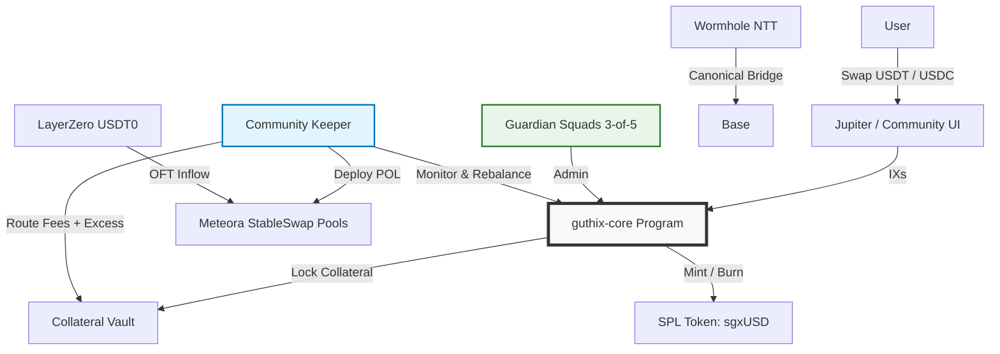

# GUTHIX Protocol

> **The Yield-Bearing Liquidity Hub**
> **Version:** 3.3.0
> **Status:** 🚧 In Development
> **Network:** Solana (Operations) | Base (Bridge)

[](https://opensource.org/licenses/MIT)
[](https://solana.com)
[](https://base.org)
[](https://wormhole.com)
[](https://layerzero.network)

---

## Overview

**GUTHIX** is a minimalist decentralised liquidity protocol and the first yield-bearing liquidity hub for the Solana stablecoin ecosystem. It is built around a single token: **sgxUSD**.

sgxUSD is a vault token. It starts at $1.00 and floats upward as protocol revenue accrues. It is not a stablecoin and makes no peg guarantee. All revenue flows to sgxUSD holders via NAV appreciation — no emissions, no governance tokens, no distributions.

Yield comes from four structurally uncorrelated sources simultaneously:

- **Ethena funding rates** via sUSDe collateral
- **Maple credit yield** via syrupUSDC collateral
- **Ondo RWA yield** via USDY collateral
- **Bridge arbitrage fees** from Wormhole-bridged USDC variants and LayerZero USDT0

No single source dominates. When one compresses, the others carry.

The protocol is a single immutable Anchor program with seven instructions. **There is no foundation, no company, and no controlling entity of any kind.** The contracts are deployed as-is under the MIT licence and cannot be upgraded by anyone — including the original developers. Frontends are community-built and permissionless.

---

## Key Properties

- **Immutable contracts** — deployed once, never upgraded; audit result is permanent
- **No controlling entity** — no foundation, company, or DAO owns or operates the protocol
- **Community frontends** — any party may build and operate an interface; no permission required
- **Native compounding** — sgxUSD paired directly against yield-bearing assets; no harvesting, no yield leakage
- **Dual bridge ecosystem** — Wormhole NTT for canonical sgxUSD bridging; LayerZero USDT0 for inbound cross-chain flow
- **Pure real yield** — 100% of revenue flows to sgxUSD NAV; zero emissions; zero dilution

---

## Architecture

### System Diagram



### Component Breakdown

| Component | Implementation | Responsibility |
| :--- | :--- | :--- |
| **Core Logic** | `guthix-core` (Anchor, immutable) | Collateral locking, NAV calculation, sgxUSD minting/burning, config |
| **Governance** | Squads Protocol (3-of-5 multisig) | Parameter updates, emergency pauses, Keeper authorisation |
| **Token** | SPL Token | sgxUSD vault token |
| **Canonical Bridge** | Wormhole NTT | lock/mint across Solana ↔ Base |
| **Cross-chain Inflow** | LayerZero USDT0 OFT | 30+ chain USDT0 routing into Tier 2 and Tier 3 pools |
| **Liquidity** | Meteora StableSwap | Protocol-Owned Liquidity across all pool tiers |
| **Maintenance** | Community Keeper (open source) | POL rebalancing, NAV updates, Swap-to-Grow routing, pool monitoring |

### Three-Tier Pool Architecture

| Tier | Pool | Role | Swap Fee |
| :--- | :--- | :--- | :--- |
| **Yield** | sgxUSD / sUSDe | Ethena funding rate yield | 0.10% |
| **Yield** | sgxUSD / syrupUSDC | Maple credit yield | 0.10% |
| **Yield** | sgxUSD / USDY | Ondo RWA yield | 0.10% |
| **Bridge** | sgxUSD / whUSDC.e | Wormhole (Ethereum) arb fees | 0.20% |
| **Bridge** | sgxUSD / whUSDC.bnb | Wormhole (BNB Chain) arb fees | 0.20% |
| **Bridge** | sgxUSD / whUSDC.poly | Wormhole (Polygon) arb fees | 0.20% |
| **Bridge** | sgxUSD / USDT0 | LayerZero OFT arb fees (30+ chains) | 0.20% |
| **Ramp** | sgxUSD / USDT | Primary entry / exit ramp | 0.05% |
| **Ramp** | sgxUSD / USDC | Secondary ramp / Jupiter routing | 0.05% |

> **Why USDT as primary ramp?** USDT is the dominant stablecoin by on-chain volume. The `sgxUSD / USDT` ramp pool and the Tier 2 `sgxUSD / USDT0` bridge pool together form a complete routing path for any LayerZero-connected chain: bridge USDT0 to Solana → swap to sgxUSD via the USDT pool → hold yield-bearing exposure. No USDC, no Wormhole required.

---

## Getting Started

### Prerequisites

- **Rust** (latest stable)
- **Solana Tool Suite** (v1.16+)
- **Anchor Framework** (v0.29+)
- **Node.js** (v18+)
- **Yarn** or **npm**

### Installation

```bash
# Clone
git clone https://github.com/RedactedBuilder/guthix.git
cd guthix

# Solana / Anchor
cargo build-bpf

# SDK
cd clients/sdk && yarn install
```

### Local Development

```bash
# Start local validator
solana-test-validator

# Deploy to devnet
anchor deploy --provider.cluster devnet

# Run tests
anchor test
```

---

## Repository Structure

```
guthix/
├── programs/
│   └── guthix-core/          # Single custom program (Vault + Config + NAV)
├── clients/
│   ├── sdk/                  # TypeScript SDK
│   └── keeper/               # Community Keeper bot (open source)
├── scripts/
│   ├── deploy-squads.ts      # Setup Guardian Multisig
│   ├── deploy-ntt.ts         # Configure Wormhole NTT
│   └── init-core.ts          # Initialise Vault Program
├── tests/
│   └── guthix-core.test.ts
├── docs/
├── Anchor.toml
├── Cargo.toml
├── litepaper.md
└── README.md
```

---

## Smart Contract Interface

### Program Instructions

```rust
pub enum Instruction {
    Initialize,           // Setup vault, token mint, guardian
    Deposit,              // Lock collateral → Mint sgxUSD at current NAV
    Withdraw,             // Burn sgxUSD → Withdraw collateral at current NAV
    WithdrawCollateral,   // Keeper-only: Unlock collateral for POL deployment
    UpdateNAV,            // Keeper-only: Update sgxUSD exchange rate
    UpdateConfig,         // Guardian-only: Adjust params, pause, keeper address
    Pause,                // Guardian-only: Emergency halt
}
```

**Only 7 instructions.** No staking logic. No governance voting. No emission schedules. No synthetic token minting. Immutable on deployment.

### Account Structure

| Account | Type | Authority | Description |
| :--- | :--- | :--- | :--- |
| `Vault` | PDA | Program | Holds all collateral (sUSDe, syrupUSDC, USDY, whUSDC variants, USDT, USDC) |
| `Config` | PDA | Guardian | Protocol parameters (fees, limits, keeper address, pool thresholds) |
| `State` | PDA | Program | Global state (TVL, sgxUSD supply, NAV, paused status) |
| `Keeper` | PDA | Guardian | Authorised keeper address for NAV updates and rebalancing |

### SDK Examples

**Deposit**
```typescript
import { GuthixSDK } from '@guthix-protocol/sdk';

const sdk = new GuthixSDK({ cluster: 'mainnet-beta' });

const tx = await sdk.deposit({
  collateralMint: USDT_MINT,
  collateralAmount: 1000_000_000, // 1000 USDT (6 decimals)
  minSgxUsdOut: 995_000_000,      // Slippage protection
  owner: wallet.publicKey,
});

await sdk.sendTransaction(tx);
// sgxUSD appreciates automatically across five yield sources from this point
```

**Exit via Secondary Market**
```typescript
// Swap sgxUSD → USDT via Jupiter — Silent Rebalance absorbs the flow
const route = await jupiter.computeRoutes({
  inputMint: SGXUSD_MINT,
  outputMint: USDT_MINT,
  amount: 1000_000_000,
});

await jupiter.exchange({ routeInfo: route.routesInfos[0] });
```

**Bridge to Base**
```typescript
import { WormholeNTT } from '@wormhole-foundation/sdk';

const ntt = new WormholeNTT({ sourceChain: 'solana', targetChain: 'base' });

const tx = await ntt.transfer({
  tokenMint: SGXUSD_MINT,
  amount: 1000_000_000,
  recipient: evmWalletAddress,
  owner: wallet.publicKey,
});

await sdk.sendTransaction(tx);
// sgxUSD minted canonically on Base — yield continues to accrue
```

---

## Keeper Bot

The Keeper is an open-source off-chain process that handles POL rebalancing, NAV updates, Swap-to-Grow routing, and bridge pool monitoring. Any party may run it. The Guardian multisig authorises which Keeper address the program accepts and may rotate it at any time.

All vault operations are PDA-signed with per-epoch withdrawal limits enforced on-chain — the Keeper holds no privileged mint authority and cannot move funds outside program rules.

### Setup

```bash
cd clients/keeper
cargo build --release
```

### Configuration

```toml
[keeper]
cluster = "mainnet-beta"
keeper_keypair = "~/.config/solana/keeper.json"
guthix_core_program = "GUTHIX_PROGRAM_ID"

[strategy]
swap_to_grow_threshold = 0.55      # Route excess USDT/USDC to vault above this
rebalance_threshold = 0.60         # Rebalance POL if sgxUSD > 60% of any pool
max_yield_pool_allocation_pct = 20
max_bridge_pool_allocation_pct = 10
bridge_depeg_threshold = 0.995     # Alert threshold for whUSDC / USDT0 depeg
```

### Running

```bash
cargo run --release -- --config config.toml

# With monitoring dashboard
cargo run --release -- --config config.toml --monitor
```

### Keeper Responsibilities

| Task | Frequency | Trigger |
| :--- | :--- | :--- |
| **Update sgxUSD NAV** | Every epoch | Collateral yield accrual + fee collection |
| **Swap-to-Grow** | As needed | Excess USDT / USDC in ramp pools above threshold |
| **Silent Rebalance** | As needed | sgxUSD sell pressure exceeds POL depth |
| **Bridge Fee Collection** | Every epoch | Tier 2 pool trading fee accrual |
| **Bridge Pool Monitoring** | Every block | whUSDC / USDT0 depeg detection |
| **Vault Solvency Check** | Every block | NAV vs. total sgxUSD supply |

---

## Testing

```bash
# All tests
anchor test

# Specific suite
anchor test --skip-deploy --skip-local-validator -- tests/guthix-core.test.ts

# Coverage
cargo llvm-cov --lcov --output-path lcov.info

# Devnet deployment
anchor deploy --provider.cluster devnet
yarn ts-node scripts/init-core.ts --cluster devnet
```

---

## Monitoring

All protocol state is publicly verifiable on-chain:

```bash
solana account <VAULT_PDA> --output json   # Vault collateral
solana account <CONFIG_PDA> --output json  # Protocol config
solana account <STATE_PDA> --output json   # NAV and supply
```

| Metric | Endpoint |
| :--- | :--- |
| NAV per sgxUSD | `/api/nav` |
| Total Collateral | `/api/collateral` |
| Yield Basket | `/api/basket` |
| Bridge Volume | `/api/bridge` |
| Protocol Revenue | `/api/revenue` |
| Keeper Activity | `/api/keeper` |

---

## Security

| Layer | Implementation | Purpose |
| :--- | :--- | :--- |
| **Immutable contracts** | `guthix-core` is non-upgradeable post-deployment | Eliminates upgrade-key risk; audit result is permanent |
| **Minimal code** | Single program; 7 instructions; one token | Smallest possible audit surface |
| **Standard dependencies** | Squads, Wormhole, SPL Token, Meteora | Battle-tested, audited infrastructure only |
| **On-chain Keeper limits** | Per-epoch withdrawal cap; NAV circuit breaker in program | Keeper compromise cannot drain vault or manipulate NAV freely |
| **Guardian multisig** | 3-of-5; emergency pause; Keeper rotation | Community backstop; no single point of control |
| **Dual-oracle pricing** | Pyth + Switchboard; TWAP; deviation circuit breakers | Manipulation-resistant NAV and collateral pricing |
| **Open-source Keeper** | MIT licence; any party may run it | No single-operator dependency |

### Audit Status

| Firm | Status | Detail |
| :--- | :--- | :--- |
| Community Review | ✅ Complete | [GitHub Issues](https://github.com/RedactedBuilder/guthix/issues) |
| OtterSec | 🚧 Planned | Pre-mainnet, Q3 2026 — prerequisite for deployment |
| Immunefi Bounty | 🚧 Planned | Active from mainnet launch |

> The protocol will not deploy to mainnet before the professional audit is complete. Because contracts are immutable, the audit result is final and permanent.

### Reporting a Vulnerability

Do not open public issues for security vulnerabilities. Contact: **security@guthix.finance**

---

## Contributing

The Keeper, SDK, and all tooling are open source. Contributions welcome.

1. Fork the repo
2. Create a feature branch (`git checkout -b feature/my-feature`)
3. Commit with clear messages (`git commit -m 'Add my feature'`)
4. Push and open a Pull Request

**Guidelines:** Follow Rust/Anchor best practices. Run `cargo fmt`. All new features must include tests. Tag security-relevant PRs with `@guthix-security`.

There is no official team to approve PRs — the community maintains this repository.

---

## Roadmap

| Phase | Timeline | Milestones |
| :--- | :--- | :--- |
| **Phase 1 — Core Foundation** | Q2 2026 | `guthix-core` devnet · Keeper MVP (open source) · All nine pools on devnet · Community audit |
| **Phase 2 — Mainnet Launch** | Q3 2026 | Professional audit complete · Immutable contracts deployed · Collateral partner POL seeding · Jupiter integration · Keeper reference published |
| **Phase 3 — Multichain** | Q4 2026 | Wormhole NTT live · sgxUSD on Base · LayerZero USDT0 routing live · Public analytics dashboard |
| **Phase 4 — Community Maintenance** | Q1 2027+ | 3+ independent Keeper operators · No single-operator dependency · Original developers no longer required for operations |

This roadmap reflects current contributor intentions. It is not a commitment. Development may slow, pause, or cease at any time. After mainnet deployment, any community contributor may continue any aspect of it independently.

---

## Further Reading

- [litepaper.md](./litepaper.md) — Protocol design, economics, and risk disclosure
- [docs/](./docs/) — Technical documentation

---

## Legal

The GUTHIX smart contracts are immutable, permissionless software deployed on public blockchains under the MIT licence. They are provided as-is with no warranty of any kind. No person or entity — including the original developers, any Guardian multisig signers, or any Keeper operators — owns, controls, or accepts liability for the protocol.

There is no GUTHIX Foundation, company, or DAO. The original developers may cease activity at any time without notice.

sgxUSD is a vault token whose value floats and is not guaranteed to appreciate. It is not a stablecoin. Collateral assets carry independent risks including depeg risk, smart contract risk, and bridge protocol risk. Participants may lose some or all of the value they deposit.

Each participant is solely responsible for determining the legality of interacting with this protocol in their jurisdiction.

---

*MIT Licence. No rights reserved by any entity.*
*Built on Solana. Secured by minimalism. One token. Five yield sources.*
