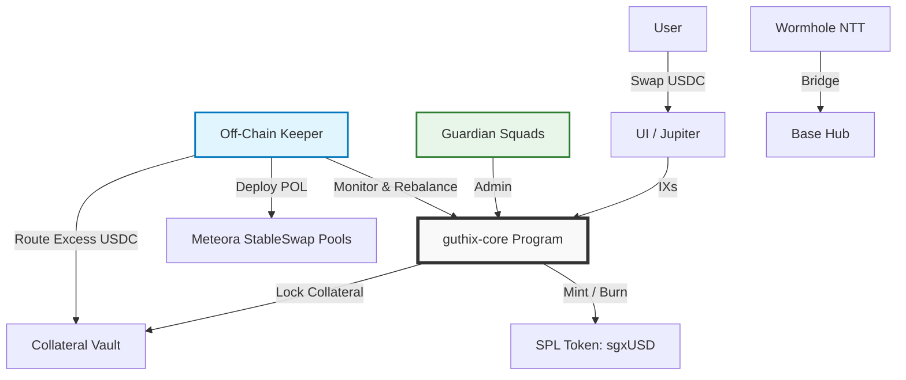

# GUTHIX Protocol

> **The Yield Vault Standard**
> **Version:** 2.1.0
> **Status:** 🚧 In Development
> **Network:** Solana (Primary) | Base (Bridge)

[](https://opensource.org/licenses/MIT)
[](https://solana.com)
[](https://base.org)
[](https://wormhole.com)

---

## 📖 Overview

**GUTHIX** is a minimalist decentralized liquidity protocol built around a single token: **sgxUSD**. Users swap USDC in, hold, and appreciate. That is the entire user experience.

sgxUSD has yield because it is always paired against yield-bearing assets. This is not a feature — it is the foundation. Protocol-Owned Liquidity (POL) is deployed into StableSwap pools pairing sgxUSD against sUSDe, syrupUSDC, and USDY. Both sides of every yield pool appreciate natively, compounding together without harvesting, without conversion, and without yield leakage.

There are no governance tokens. No token emissions. No staking UI. No redemption queues. No synthetic units. One token, one action, passive yield.

### 🔑 Key Features

- **Yield-Bearing Foundation:** sgxUSD is paired against yield-bearing assets from day one. Native collateral yield compounds directly into sgxUSD NAV without harvesting.
- **Pure Real Yield:** 100% of protocol revenue (collateral yield + trading fees) flows to sgxUSD holders via NAV appreciation. Zero emissions. Zero dilution.
- **Swap-to-Grow:** Excess USDC from secondary market buys routes directly to vault collateral, raising sgxUSD NAV instantly for all holders.
- **Silent Rebalance:** User exits are absorbed by POL and rebalanced by an off-chain Keeper — no redemption queues, no user friction.
- **Minimalist Security:** Single custom Anchor program (`guthix-core`). Governance via Squads Multisig. Bridging via Wormhole NTT.

---

## 🏗 Architecture

### System Diagram



### Component Breakdown

| Component | Implementation | Responsibility |
| :--- | :--- | :--- |
| **Core Logic** | `guthix-core` (Anchor) | Collateral locking, NAV calculation, sgxUSD minting/burning, config |
| **Governance** | Squads Protocol (Multisig) | Parameter updates, emergency pauses, Keeper authorization |
| **Token** | SPL Token | sgxUSD vault token |
| **Bridging** | Wormhole NTT | Canonical lock/mint across Solana ↔ Base |
| **Liquidity** | Meteora StableSwap | Protocol-Owned Liquidity across all pool pairs |
| **Maintenance** | Off-Chain Keeper (Rust/TS) | POL rebalancing, NAV updates, Swap-to-Grow routing, pool monitoring |

### Pool Architecture

| Pool | Role | Swap Fee |
| :--- | :--- | :--- |
| **sgxUSD / sUSDe** | Yield engine — Ethena funding rate yield | 0.10% |
| **sgxUSD / syrupUSDC** | Yield engine — Maple credit yield | 0.10% |
| **sgxUSD / USDY** | Yield engine — Ondo RWA yield | 0.10% |
| **sgxUSD / USDC** | Entry / exit ramp only | 0.05% |

---

## 🚀 Getting Started

### Prerequisites

- **Rust** (Latest stable version)
- **Solana Tool Suite** (v1.16+)
- **Anchor Framework** (v0.29+)
- **Node.js** (v18+)
- **Yarn** or **npm**

### Installation

1. **Clone the Repository**
    ```bash
    git clone https://github.com/guthix-protocol/guthix-core.git
    cd guthix-core
    ```

2. **Install Dependencies**
    ```bash
    # Solana/Anchor
    cargo build-bpf

    # Frontend/SDK
    cd client
    yarn install
    ```

3. **Local Development**
    ```bash
    # Start local validator
    solana-test-validator

    # Deploy programs (Devnet)
    anchor deploy --provider.cluster devnet
    ```

4. **Run Tests**
    ```bash
    anchor test
    ```

---

## 📂 Repository Structure

```text
guthix-core/
├── programs/
│   └── guthix-core/       # Single custom program (Vault + Config + NAV)
├── clients/
│   ├── sdk/               # TypeScript SDK for interaction
│   └── keeper/            # Rust/TS bot for POL rebalancing and NAV updates
├── scripts/
│   ├── deploy-squads.ts   # Setup Guardian Multisig
│   ├── deploy-ntt.ts      # Configure Wormhole NTT
│   └── init-core.ts       # Initialize Vault Program
├── tests/
│   └── guthix-core.test.ts
├── Anchor.toml
├── Cargo.toml
└── README.md
```

---

## 🛠 Smart Contract Interface

### Program Instructions

```rust
// guthix-core program instructions
pub enum Instruction {
    Initialize,           // Setup vault, token mint, guardian
    Deposit,              // Lock collateral → Mint sgxUSD at current NAV
    Withdraw,             // Burn sgxUSD → Withdraw collateral at current NAV
    WithdrawCollateral,   // Keeper-only: Unlock collateral for POL deployment
    UpdateNAV,            // Keeper-only: Update sgxUSD exchange rate
    UpdateConfig,         // Guardian-only: Adjust params, pause, keeper address
    Pause,                // Guardian-only: Emergency halt
}
```

✅ **Only 7 instructions.** No staking logic. No governance voting. No emission schedules. No synthetic token minting.

### Account Structure

| Account | Type | Authority | Description |
| :--- | :--- | :--- | :--- |
| `Vault` | PDA | Program | Holds all collateral (sUSDe, syrupUSDC, USDY, USDC) |
| `Config` | PDA | Guardian | Protocol parameters (fees, limits, keeper address) |
| `State` | PDA | Program | Global state (TVL, supply, NAV, paused status) |
| `Keeper` | PDA | Guardian | Authorized keeper for NAV and rebalancing operations |

### Example: Depositing USDC for sgxUSD (TypeScript SDK)

```typescript
import { GuthixSDK } from '@guthix-protocol/sdk';

const sdk = new GuthixSDK({ cluster: 'mainnet-beta' });

// Deposit USDC → Receive sgxUSD at current NAV
const tx = await sdk.deposit({
  collateralMint: USDC_MINT,
  collateralAmount: 1000_000_000, // 1000 USDC (6 decimals)
  minSgxUsdOut: 995_000_000,      // Slippage protection
  owner: wallet.publicKey,
});

await sdk.sendTransaction(tx);
// sgxUSD balance appreciates automatically from this point
```

### Example: Exiting via Secondary Market

```typescript
// Exit by swapping sgxUSD → USDC on Jupiter
// POL absorbs the flow via Silent Rebalance — no redemption instruction needed
const jupiter = new Jupiter({ cluster: 'mainnet-beta' });

const route = await jupiter.computeRoutes({
  inputMint: SGXUSD_MINT,
  outputMint: USDC_MINT,
  amount: 1000_000_000,
});

await jupiter.exchange({ routeInfo: route.routesInfos[0] });
```

---

## 🤖 Keeper Bot

The off-chain Keeper manages POL deployment, NAV updates, and Swap-to-Grow routing. It requires no privileged minting authority — all vault operations are PDA-signed with per-epoch withdrawal limits.

### Setup

```bash
cd clients/keeper
cargo build --release
```

### Configuration

```toml
# keeper/config.toml
[keeper]
cluster = "mainnet-beta"
keeper_keypair = "~/.config/solana/keeper.json"
guthix_core_program = "GUTHIX_PROGRAM_ID"

[strategy]
# Swap-to-Grow: route excess USDC to vault if USDC > 55% of sgxUSD/USDC pool
swap_to_grow_threshold = 0.55
# Silent Rebalance: rebalance POL if sgxUSD > 60% of any yield pool
rebalance_threshold = 0.60
# Maximum POL allocation as % of TVL per pool
max_pool_allocation_pct = 35
```

### Running the Keeper

```bash
# Start keeper bot
cargo run --release -- --config config.toml

# Run with monitoring dashboard
cargo run --release -- --config config.toml --monitor
```

### Keeper Responsibilities

| Task | Frequency | Trigger |
| :--- | :--- | :--- |
| **Update sgxUSD NAV** | Every epoch | Collateral yield accrual + fee collection |
| **Swap-to-Grow** | As needed | Excess USDC in sgxUSD/USDC pool > threshold |
| **Silent Rebalance** | As needed | sgxUSD sell pressure exceeds POL depth |
| **Pool Health Monitor** | Every block | Collateral asset depeg detection |
| **Vault Solvency Check** | Every block | NAV vs. total sgxUSD supply |

### Swap-to-Grow Logic

When users buy sgxUSD on secondary markets (USDC → sgxUSD), USDC accumulates in the POL pool. The Keeper detects excess USDC and routes it to the vault:

1. **Detect** excess USDC in sgxUSD/USDC pool above threshold
2. **Withdraw** excess USDC from POL position
3. **Route** USDC to vault as additional collateral
4. **Update NAV** — collateral backing per sgxUSD increases; no new sgxUSD minted

**Result:** Every secondary market buy raises sgxUSD NAV for all holders instantly.

---

## 🧪 Testing

### Unit Tests

```bash
# Run all tests
anchor test

# Run specific test suite
anchor test --skip-deploy --skip-local-validator -- tests/guthix-core.test.ts
```

### Test Coverage

```bash
# Generate coverage report
cargo llvm-cov --lcov --output-path lcov.info
```

### Devnet Deployment

```bash
# Deploy to devnet
anchor deploy --provider.cluster devnet

# Initialize protocol
yarn ts-node scripts/init-core.ts --cluster devnet
```

---

## 📊 Monitoring & Analytics

### Key Metrics Dashboard

| Metric | Endpoint | Description |
| :--- | :--- | :--- |
| **NAV per sgxUSD** | `/api/nav` | Current net asset value per token |
| **Total Collateral** | `/api/collateral` | Sum of all locked collateral (USD) |
| **Collateral Basket** | `/api/basket` | Per-asset allocation (sUSDe / syrupUSDC / USDY / USDC) |
| **Protocol Revenue** | `/api/revenue` | 24h/7d/30d fee + collateral yield |
| **Keeper Activity** | `/api/keeper` | Last rebalance, Swap-to-Grow, NAV update |

### On-Chain Verification

All protocol state is publicly verifiable on Solana:

```bash
# View vault collateral
solana account <VAULT_PDA> --output json

# View protocol config
solana account <CONFIG_PDA> --output json

# View sgxUSD NAV
solana account <STATE_PDA> --output json
```

---

## 🛡 Security

### Defense-in-Depth Strategy

| Layer | Implementation | Purpose |
| :--- | :--- | :--- |
| **Minimal Code** | Single custom program (`guthix-core`); 7 instructions | Smallest possible audit surface |
| **Standard Dependencies** | Squads, Wormhole, SPL Token, Meteora | Battle-tested, audited infrastructure only |
| **Off-Chain Keeper** | Logic upgradable without redeployment; PDA-signed withdrawals | Isolate complexity; enable rapid iteration |
| **Guardian Multisig** | 3-of-5 trusted signers; emergency pause | Human oversight for black-swan events |
| **Transparency** | Real-time NAV, collateral proofs on-chain | Community verification; reduced information asymmetry |

### Audit Status

| Audit Firm | Status | Report |
| :--- | :--- | :--- |
| **Community Review** | ✅ Complete | [GitHub Issues](https://github.com/guthix-protocol/guthix-core/issues) |
| **OtterSec** | 🚧 In Progress | Expected Q3 2026 |
| **Immunefi Bounty** | 🚧 Planned | Post-mainnet launch |

### Reporting a Vulnerability

Please do not open public issues for security vulnerabilities. Report them directly to **security@guthix.finance**.

---

## 🤝 Contributing

We welcome contributions from the community!

1. **Fork the Repo**
2. **Create a Feature Branch** (`git checkout -b feature/amazing-feature`)
3. **Commit Changes** (`git commit -m 'Add amazing feature'`)
4. **Push to Branch** (`git push origin feature/amazing-feature`)
5. **Open a Pull Request**

### Contribution Guidelines

- **Code Style:** Follow Rust/Anchor best practices. Run `cargo fmt` before committing.
- **Tests:** All new features must include unit and integration tests.
- **Documentation:** Update README and inline docs for any new instructions or accounts.
- **Security:** No PRs without security consideration. Tag `@guthix-security` for review.

Please read our [Contributing Guidelines](./CONTRIBUTING.md) for details on our code of conduct and development process.

---

## 🗓 Roadmap

| Phase | Timeline | Milestones |
| :--- | :--- | :--- |
| **Phase 1: Core Foundation** | Q2 2026 | • `guthix-core` devnet deployment <br> • SPL Token integration <br> • Keeper bot MVP <br> • All four pools on devnet <br> • Community audit |
| **Phase 2: Mainnet Launch** | Q3 2026 | • Professional audit complete <br> • Collateral partner POL seeding (Ethena / Maple / Ondo) <br> • All four pools live on mainnet <br> • Jupiter aggregator integration |
| **Phase 3: Multichain** | Q4 2026 | • Wormhole NTT (Solana ↔ Base) <br> • Lending protocol integrations (Kamino / MarginFi) <br> • Public analytics dashboard |
| **Phase 4: Decentralization** | Q1 2027 | • Guardian Council activation <br> • Safety Fund >5% TVL <br> • Keeper bonding (optional) <br> • Additional collateral assets (community vote) |

---

## 📄 License

This project is licensed under the MIT License — see the [LICENSE](./LICENSE) file for details.

---

## ⚠️ Disclaimer

*This repository is for informational purposes only and does not constitute financial advice, investment recommendations, or an offer to sell or solicitation of an offer to buy any securities. GUTHIX is a decentralized protocol. sgxUSD is a vault token whose value floats and is not guaranteed to appreciate. Collateral assets including sUSDe, syrupUSDC, and USDY carry their own independent risks. Participants acknowledge that they are using the software at their own risk. Cryptocurrency investments are volatile and high-risk. Please consult a qualified financial advisor before making any investment decisions.*

---

## 📞 Contact

- **Website:** [www.guthix.finance](https://www.guthix.finance)
- **Twitter:** [@GuthixProtocol](https://twitter.com/GuthixFinance)
- **Email:** [research@guthix.finance](mailto:research@guthix.finance)
- **Partnerships:** [partnerships@guthix.finance](mailto:partnerships@guthix.finance)
- **Security:** [security@guthix.finance](mailto:security@guthix.finance)

---

*© 2026 Guthix Protocol Foundation. All rights reserved.*
*Built on Solana. Secured by minimalism.*
*One token. Pure yield. Liquidity that builds itself.*
