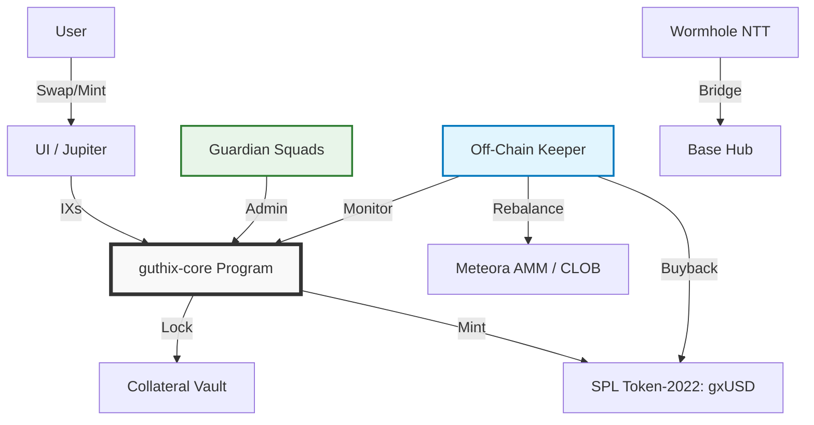

# GUTHIX Protocol

> **The Synthetic Liquidity Standard**  
> **Version:** 1.1.0 (Pure Real Yield)  
> **Status:** 🚧 In Development  
> **Network:** Solana (Primary) | Base (Bridge)

[](https://opensource.org/licenses/MIT)
[](https://solana.com)
[](https://base.org)
[](https://wormhole.com)

---

## 📖 Overview

**GUTHIX** is a minimalist decentralized liquidity protocol that unifies fragmented stablecoin markets through a revenue-first architecture. Unlike traditional stablecoin protocols, GUTHIX operates without direct redemptions, inflationary emissions, or complex governance tokens.

The protocol functions as a **Vault-as-Market-Maker**: collateral is deployed into deep liquidity pools, and 100% of protocol revenue flows directly to **sgxUSD** stakers via NAV appreciation.

### 🔑 Key Features

*   **Swap-to-Grow:** Due to Protocol-Owned Liquidity (POL), every secondary market swap (USDC → gxUSD) effectively grows the vault collateral base.
*   **Pure Real Yield:** 100% of protocol revenue (fees + collateral yield) flows to sgxUSD stakers. Zero inflationary emissions.
*   **Minimalist Security:** Single custom Anchor program (`guthix-core`). Governance via Squads Multisig. Bridging via Wormhole NTT.
*   **Silent Rebalance:** User sells (gxUSD → USDC) are absorbed by POL and rebalanced by the Keeper without user friction or redemption queues.
*   **Abstracted Liquidity:** Users hold gxUSD/sgxUSD without managing LP positions. The Keeper manages depth automatically.

---

## 🏗 Architecture

### System Diagram



### Component Breakdown

| Component | Implementation | Responsibility |
| :--- | :--- | :--- |
| **Core Logic** | `guthix-core` (Anchor) | Minting, Collateral Locking, Config, sgxUSD Staking |
| **Governance** | Squads Protocol (Multisig) | Parameter updates, Emergency pauses, Keeper authorization |
| **Token** | SPL Token-2022 | gxUSD standard (metadata, extensions); sgxUSD as receipt token |
| **Bridging** | Wormhole NTT | Canonical lock/mint across Solana ↔ Base |
| **Liquidity** | Meteora StableSwap + Solana CLOB | Protocol-Owned Liquidity (POL) for core and bridge pairs |
| **Maintenance** | Off-Chain Keeper (Rust/TS) | Buybacks, LP rebalancing, NAV monitoring, revenue collection |

---

## 🚀 Getting Started

### Prerequisites

*   **Rust** (Latest stable version)
*   **Solana Tool Suite** (v1.16+)
*   **Anchor Framework** (v0.29+)
*   **Node.js** (v18+)
*   **Yarn** or **npm**

### Installation

1.  **Clone the Repository**
    ```bash
    git clone https://github.com/guthix-protocol/guthix-core.git  
    cd guthix-core
    ```

2.  **Install Dependencies**
    ```bash
    # Solana/Anchor
    cargo build-bpf
    
    # Frontend/SDK
    cd client
    yarn install
    ```

3.  **Local Development**
    ```bash
    # Start local validator
    solana-test-validator
    
    # Deploy programs (Devnet)
    anchor deploy --provider.cluster devnet
    ```

4.  **Run Tests**
    ```bash
    anchor test
    ```

---

## 📂 Repository Structure

```text
guthix-core/
├── programs/
│   └── guthix-core/       # ONLY custom program (Vault + Config + Staking)
├── clients/
│   ├── sdk/               # TypeScript SDK for interaction
│   └── keeper/            # Rust/TS bot for buyback/LP rebalancing
├── scripts/
│   ├── deploy-squads.ts   # Setup Guardian Multisig
│   ├── deploy-ntt.ts      # Configure Wormhole NTT
│   └── init-core.ts       # Initialize Vault Program
├── tests/
│   └── guthix-core.test.ts
├── Anchor.toml
├── Cargo.toml
└── README.md
```

---

## 🛠 Smart Contract Interface

### Program Instructions

```rust
// guthix-core program instructions
pub enum Instruction {
    Initialize,           // Setup vault, token mint, guardian
    Deposit,              // Lock collateral → Mint gxUSD (Primary Market)
    Stake,                // Deposit gxUSD → Mint sgxUSD
    Unstake,              // Burn sgxUSD → Withdraw gxUSD + yield
    WithdrawCollateral,   // Keeper-only: Unlock collateral for rebalancing
    UpdateConfig,         // Guardian-only: Adjust fees, pause, keeper address
    Pause,                // Guardian-only: Emergency halt
}
```

### Account Structure

| Account | Type | Authority | Description |
| :--- | :--- | :--- | :--- |
| `Vault` | PDA | Program | Holds all collateral (USDC, sUSDe, etc.) |
| `Config` | PDA | Guardian | Protocol parameters (fees, limits, keeper address) |
| `State` | PDA | Program | Global state (TVL, supply, NAV, paused status) |
| `UserPosition` | PDA | User | Tracks user's sgxUSD balance & accrual |
| `Keeper` | PDA | Guardian | Authorized keeper for revenue operations |

### Example: Minting gxUSD (TypeScript SDK)

```typescript
import { GuthixSDK } from '@guthix-protocol/sdk';

const sdk = new GuthixSDK({ cluster: 'mainnet-beta' });

// Primary Market: Mint gxUSD with USDC collateral
const tx = await sdk.mint({
  collateralMint: USDC_MINT,
  collateralAmount: 1000_000_000, // 1000 USDC (6 decimals)
  minGxUsdOut: 995_000_000,      // Slippage protection
  owner: wallet.publicKey,
});

await sdk.sendTransaction(tx);
```

### Example: Staking for sgxUSD

```typescript
// Stake gxUSD to earn yield (NAV appreciation)
const tx = await sdk.stake({
  gxUsdAmount: 1000_000_000, // 1000 gxUSD
  owner: wallet.publicKey,
});

await sdk.sendTransaction(tx);
// sgxUSD balance will accrue yield automatically
```

---

## 🤖 Keeper Bot

The off-chain Keeper manages protocol revenue, buybacks, and **POL Rebalancing**.

### Setup

```bash
cd clients/keeper
cargo build --release
```

### Configuration

```toml
# keeper/config.toml
[keeper]
cluster = "mainnet-beta"
keeper_keypair = "~/.config/solana/keeper.json"
guthix_core_program = "GUTHIX_PROGRAM_ID"

[strategy]
# Rebalance Trigger: If AMM USDC > 55% of pool value
rebalance_threshold = 0.55  
# Buyback Trigger: If market price < 98% of NAV
buyback_threshold = 0.98  
# Max 50% of TVL in LP positions
lp_allocation_pct = 50  
```

### Running the Keeper

```bash
# Start keeper bot
cargo run --release -- --config config.toml

# Run with monitoring dashboard
cargo run --release -- --config config.toml --monitor
```

### Keeper Responsibilities

| Task | Frequency | Trigger |
| :--- | :--- | :--- |
| **Collect Trading Fees** | Every epoch | Meteora/CLOB fee accrual |
| **Update sgxUSD Exchange Rate** | Every epoch | New yield available |
| **POL Rebalance (Swap-to-Grow)** | As needed | AMM USDC ratio > threshold |
| **Buyback gxUSD** | As needed | Price < NAV * threshold |
| **Health Check** | Every block | Monitor vault solvency |

### POL Rebalancing Logic (Swap-to-Grow)
When users buy gxUSD on secondary markets (USDC → gxUSD), USDC flows into the Protocol-Owned Liquidity pool. The Keeper detects excess USDC and rebalances:

1.  **Withdraw** excess USDC from AMM.
2.  **Mint** new gxUSD via Vault (increasing collateral base).
3.  **Re-deposit** gxUSD into AMM to restore liquidity depth.

**Result:** Secondary swaps automatically grow the protocol vault.

---

## 🧪 Testing

### Unit Tests

```bash
# Run all tests
anchor test

# Run specific test suite
anchor test --skip-deploy --skip-local-validator -- tests/guthix-core.test.ts
```

### Test Coverage

```bash
# Generate coverage report
cargo llvm-cov --lcov --output-path lcov.info
```

### Devnet Deployment

```bash
# Deploy to devnet
anchor deploy --provider.cluster devnet

# Initialize protocol
yarn ts-node scripts/init-core.ts --cluster devnet
```

---

## 📊 Monitoring & Analytics

### Key Metrics Dashboard

| Metric | Endpoint | Description |
| :--- | :--- | :--- |
| **NAV per gxUSD** | `/api/nav` | Current net asset value per token |
| **Total Collateral** | `/api/collateral` | Sum of all locked collateral (USD) |
| **sgxUSD Exchange Rate** | `/api/exchange-rate` | sgxUSD → gxUSD conversion rate |
| **Protocol Revenue** | `/api/revenue` | 24h/7d/30d fee + yield revenue |
| **Keeper Activity** | `/api/keeper` | Last rebalance, buyback, health check |

### On-Chain Verification

All protocol state is publicly verifiable on Solana:

```bash
# View vault collateral
solana account <VAULT_PDA> --output json

# View protocol config
solana account <CONFIG_PDA> --output json

# View sgxUSD exchange rate
solana account <STATE_PDA> --output json
```

---

## 🛡 Security

### Defense-in-Depth Strategy

| Layer | Implementation | Purpose |
| :--- | :--- | :--- |
| **Minimal Code** | Single custom program (`guthix-core`) | Reduce audit surface; simplify verification |
| **Standard Dependencies** | Squads, Wormhole, SPL Token-2022 | Leverage battle-tested, audited infrastructure |
| **Off-Chain Keeper** | Logic upgradable without contract redeployment | Isolate complex logic; enable rapid iteration |
| **Guardian Multisig** | 3-of-5 trusted signers | Human oversight for black-swan events |
| **Transparency** | Real-time NAV, collateral proofs on-chain | Enable community verification |

### Audit Status

| Audit Firm | Status | Report |
| :--- | :--- | :--- |
| **Community Review** | ✅ Complete | [GitHub Issues](https://github.com/guthix-protocol/guthix-core/issues) |
| **OtterSec** | 🚧 In Progress | Expected Q3 2026 |
| **Immunefi Bounty** | 🚧 Planned | Post-mainnet launch |

### Reporting a Vulnerability

Please do not open public issues for security vulnerabilities. Report them directly to **security@guthix.finance**.

---

## 🤝 Contributing

We welcome contributions from the community!

1.  **Fork the Repo**
2.  **Create a Feature Branch** (`git checkout -b feature/amazing-feature`)
3.  **Commit Changes** (`git commit -m 'Add amazing feature'`)
4.  **Push to Branch** (`git push origin feature/amazing-feature`)
5.  **Open a Pull Request**

### Contribution Guidelines

*   **Code Style:** Follow Rust/Anchor best practices. Run `cargo fmt` before committing.
*   **Tests:** All new features must include unit and integration tests.
*   **Documentation:** Update README and inline docs for any new instructions or accounts.
*   **Security:** No PRs without security consideration. Tag `@guthix-security` for review.

Please read our [Contributing Guidelines](./CONTRIBUTING.md) for details on our code of conduct and development process.

---

## 🗓 Roadmap

| Phase | Timeline | Milestones |
| :--- | :--- | :--- |
| **Phase 1: Core Foundation** | Q2 2026 | • `guthix-core` devnet deployment <br> • SPL Token-2022 integration <br> • Keeper bot MVP |
| **Phase 2: Liquidity Layer** | Q3 2026 | • Meteora AMM integration <br> • POL seed deployment <br> • sgxUSD staking launch <br> • Mainnet beta |
| **Phase 3: Multichain** | Q4 2026 | • Wormhole NTT (Solana ↔ Base) <br> • CLOB liquidity depth <br> • Jupiter aggregator integration |
| **Phase 4: Decentralization** | Q1 2027 | • Guardian Council activation <br> • Safety Fund >5% TVL <br> • Keeper bonding (optional) |
| **Phase 5: Governance (Optional)** | Q3 2027+ | • GTX TGE (community vote) <br> • DAO transition |

---

## 📄 License

This project is licensed under the MIT License - see the [LICENSE](./LICENSE) file for details.

---

## ⚠️ Disclaimer

*This repository is for informational purposes only and does not constitute financial advice, investment recommendations, or an offer to sell or solicitation of an offer to buy any securities. GUTHIX is a decentralized protocol. Participants acknowledge that they are using the software at their own risk. Cryptocurrency investments are volatile and high-risk. Please consult a qualified financial advisor before making any investment decisions.*

---

## 📞 Contact

*   **Website:** [www.guthix.finance](https://www.guthix.finance)
*   **Twitter:** [@GuthixProtocol](https://twitter.com/GuthixProtocol)
*   **Email:** [research@guthix.finance](mailto:research@guthix.finance)
*   **Security:** [security@guthix.finance](mailto:security@guthix.finance)

---

*© 2026 Guthix Protocol Foundation. All rights reserved.*  
*Built on Solana. Secured by minimalism.*
