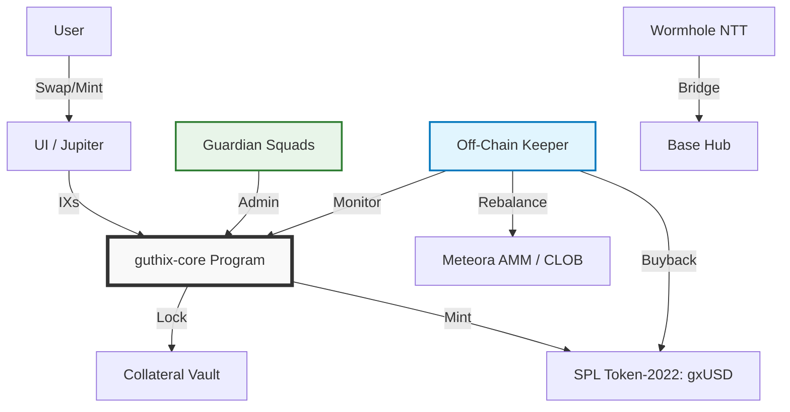
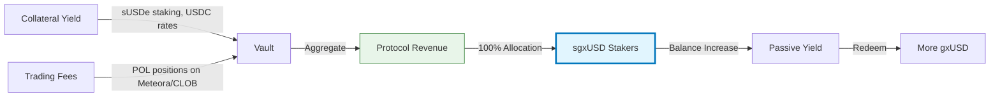
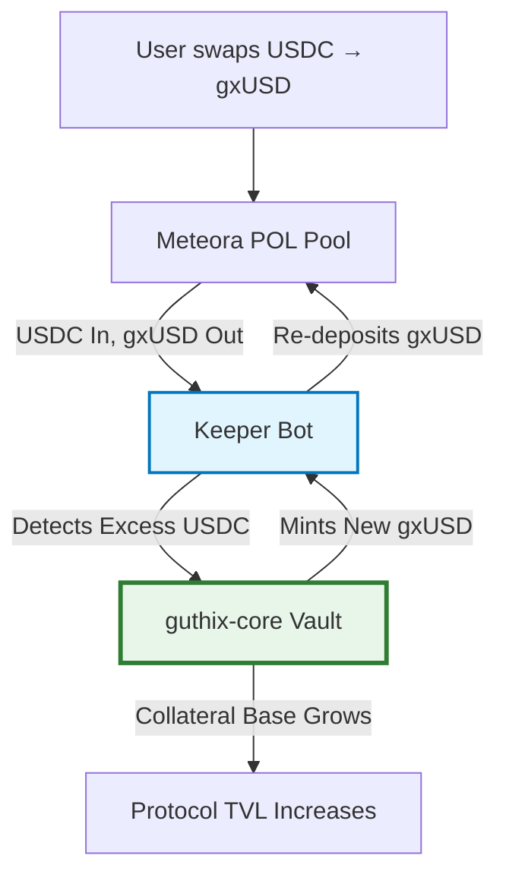

# GUTHIX Protocol Litepaper

> **The Synthetic Liquidity Standard**  
> **Version:** 1.2.0 (Final — Pure Real Yield)  
> **Date:** March 2026  
> **Status:** 🚧 In Development  
> **Network:** Solana (Operations) | Base (Governance Hub)

---

## 📋 Abstract

GUTHIX is a minimalist decentralized liquidity protocol that unifies fragmented stablecoin markets through a revenue-first, emission-free architecture. Unlike traditional stablecoin protocols that rely on direct redemptions, inflationary token emissions, or complex governance mechanics, GUTHIX operates as a **Vault-as-Market-Maker**: collateral is deployed into deep, protocol-owned liquidity pools, and 100% of protocol revenue flows directly to **sgxUSD** stakers via NAV appreciation.

By abstracting liquidity management into a simple token interface, GUTHIX enables users to access cross-chain liquidity and sustainable yield without managing positions, staking, or locking assets. This litepaper outlines the protocol's architecture, economic model, and roadmap for a capital-efficient, self-reinforcing liquidity standard.

**Key Innovations:**
- **Swap-to-Grow:** Secondary market swaps automatically expand the protocol vault via Protocol-Owned Liquidity (POL) rebalancing.
- **Silent Rebalance:** User exits are absorbed by POL and rebalanced by an off-chain Keeper—no redemption queues, no user friction.
- **Passive Liquidity Deepening:** Collateral yield and trading fees compound over time, making the protocol safer and deeper without external incentives.
- **Pure Real Yield:** 100% of revenue flows to sgxUSD stakers. Zero inflationary emissions. Zero dilution.

---

## 🎯 Problem Statement

### Fragmented Liquidity
Stablecoin liquidity is siloed across chains, AMMs, and collateral types. Traders face high slippage; LPs face impermanent loss and emission dependency.

### Unsustainable Yield Models
Most protocols subsidize APY with inflationary token emissions, creating sell pressure and mercenary capital that exits when rewards end.

### Complexity Overhead
Redemption queues, governance voting, PID controllers, and multi-token systems increase smart contract risk and user friction.

### Regulatory Uncertainty
Yield-bearing tokens with emission mechanics face heightened scrutiny as potential unregistered securities.

---

## 💡 Solution Overview

GUTHIX addresses these challenges through four core principles:

| Principle | Implementation | Benefit |
|-----------|---------------|---------|
| **Minimalist Security** | Single custom Anchor program (`guthix-core`); governance via Squads Multisig; bridging via Wormhole NTT | Reduced audit surface; lower attack vector count |
| **Pure Real Yield** | 100% of protocol revenue (fees + collateral yield) flows to sgxUSD stakers; zero inflationary emissions | Sustainable APY; no dilution; regulatory clarity |
| **Swap-to-Grow** | Protocol-Owned Liquidity (POL) + synthetic token design: every USDC → gxUSD swap expands vault collateral | Organic growth without user friction; no minting UI required |
| **Silent Rebalance** | Off-chain Keeper absorbs secondary market sells and rebalances vault collateral automatically | No redemption queues; no bank-run vector; seamless exits |

---

## 🏗 Technical Architecture

### Minimalist Design Philosophy



### Component Breakdown

| Component | Implementation | Responsibility |
| :--- | :--- | :--- |
| **Core Logic** | `guthix-core` (Anchor) | Minting, Collateral Locking, Config, sgxUSD Staking |
| **Governance** | Squads Protocol (Multisig) | Parameter updates, Emergency pauses, Keeper authorization |
| **Token** | SPL Token-2022 | gxUSD standard (metadata, extensions); sgxUSD as receipt token |
| **Bridging** | Wormhole NTT | Canonical lock/mint across Solana ↔ Base |
| **Liquidity** | Meteora StableSwap + Solana CLOB | Protocol-Owned Liquidity (POL) for core and bridge pairs |
| **Maintenance** | Off-Chain Keeper (Rust/TS) | POL rebalancing, buybacks, NAV monitoring, revenue collection |

### Smart Contract Scope (v1.0)

```rust
// guthix-core program instructions
pub enum Instruction {
    Initialize,           // Setup vault, token mint, guardian
    Deposit,              // Lock collateral → Mint gxUSD (Primary Market)
    Stake,                // Deposit gxUSD → Mint sgxUSD
    Unstake,              // Burn sgxUSD → Withdraw gxUSD + yield
    WithdrawCollateral,   // Keeper-only: Unlock collateral for rebalancing
    UpdateConfig,         // Guardian-only: Adjust fees, pause, keeper address
    Pause,                // Guardian-only: Emergency halt
}
```

✅ **Only 7 instructions.** No redemption logic. No governance voting. No emission schedules.

---

## 💰 Tokenomics: gxUSD & sgxUSD

### gxUSD: The Liquidity Token

| Property | Specification |
|----------|--------------|
| **Type** | SPL Token-2022 (non-interest-bearing) |
| **Peg Target** | Synthetic $1.00 USD (market-driven) |
| **Collateral** | Tiered basket: USDC (Core), sUSDe/syrupUSDC (Yield), whUSDC/USDT0 (Bridge) |
| **Minting** | Open: Deposit approved collateral → Mint gxUSD (Primary Market) |
| **Secondary Acquisition** | Swap USDC → gxUSD on AMM (Secondary Market) — triggers Swap-to-Grow |
| **Redemption** | ❌ Disabled (no direct burn for collateral) |
| **Exit** | Secondary market: Swap gxUSD → USDC on AMM/CLOB (Silent Rebalance) |
| **Bridging** | ✅ Enabled: Burn on Solana → Mint canonical on Base via Wormhole NTT |

### sgxUSD: The Yield-Bearing Variant

| Property | Specification |
|----------|--------------|
| **Type** | SPL Token-2022 (receipt token) |
| **Mechanism** | Balance accrual: Deposit 1 gxUSD → Receive 1 sgxUSD; balance increases over time |
| **Yield Source** | 100% of protocol revenue: Collateral interest + Trading fees from POL |
| **Accrual** | Off-chain calculation; on-chain exchange rate updated by Keeper |
| **Redemption** | Burn sgxUSD → Withdraw gxUSD at current exchange rate (principal + yield) |
| **Transferability** | ✅ Fully transferable; yield stays with token |

### Value Accrual Flow



### Example: Yield Calculation

```
Initial: Deposit 1,000 gxUSD → Receive 1,000 sgxUSD
After 30 days:
- Collateral yield: 5% APY → +0.41% for month
- Trading fees: 3% APY on POL → +0.25% for month
- Total accrual: +0.66%
Result: 1,000 sgxUSD now redeemable for 1,006.6 gxUSD
Effective APY: ~8% (compounding)
```

---

## 🔄 Economic Model: The Real Yield Flywheel

### Core Loop

1. **Collateral Deposit or Swap**: Users mint gxUSD directly OR swap USDC → gxUSD on AMM.
2. **Liquidity Deployment**: Keeper deploys collateral into Meteora StableSwap (gxUSD/USDC) and CLOB pairs as POL.
3. **Revenue Generation**: Pools earn trading fees; collateral earns yield.
4. **Revenue Collection**: Keeper aggregates fees + yield → updates sgxUSD exchange rate.
5. **Swap-to-Grow Rebalance**: If AMM accumulates excess USDC from buys, Keeper mints new gxUSD and re-deposits to restore balance—expanding vault collateral.
6. **Silent Rebalance on Sells**: If users sell gxUSD → USDC, POL absorbs the flow; Keeper burns returned gxUSD or rebalances to maintain NAV.
7. **User Benefit**: Holders earn passive yield via NAV appreciation; traders access deep, self-deepening liquidity.

### Why This Works Without Emissions

| Traditional Farm | **GUTHIX Real Yield** |
| :--- | :--- |
| APY = Fees + Token Emissions | APY = Fees + Collateral Yield |
| Emissions create sell pressure | No emissions = no artificial sell pressure |
| APY collapses when emissions end | APY scales with real revenue |
| Mercenary capital churns | Sticky capital: yield seekers hold for compounding |
| Complex staking/claiming UX | Simple hold-to-earn: no actions required |

### Swap-to-Grow: The Key Innovation

Because **gxUSD is synthetic** (protocol-mintable) and **liquidity is Protocol-Owned**, every USDC → gxUSD swap on secondary markets effectively grows the protocol:



**Result:** Users just swap on Jupiter. The protocol grows automatically.

### Capital Efficiency Comparison

```
Dual-Token Model:
$1M TVL → $100K/day revenue → $50K to LPs + $50K to token emissions
→ Token sells down → Real yield to LPs: ~5% APY

GUTHIX Model:
$1M TVL → $100K/day revenue → $100K to sgxUSD stakers
→ No dilution → Real yield to stakers: ~10% APY
→ Plus: Every swap grows the vault organically
```

**Result:** GUTHIX delivers ~2x the *real* yield per dollar of revenue by eliminating emission leakage—and grows without user friction.

---

## 🛡 Security & Risk Management

### Defense-in-Depth Strategy

| Layer | Implementation | Purpose |
| :--- | :--- | :--- |
| **Minimal Code** | Single custom program (`guthix-core`) | Reduce audit surface; simplify verification |
| **Standard Dependencies** | Squads (governance), Wormhole (bridging), SPL (token) | Leverage battle-tested, audited infrastructure |
| **Off-Chain Keeper** | Logic upgradable without contract redeployment; PDA-signed withdrawals | Isolate complex logic; enable rapid iteration |
| **Guardian Multisig** | 3-of-5 trusted signers; emergency pause; config updates | Human oversight for black-swan events |
| **Transparency** | Real-time NAV, collateral proofs, keeper activity on-chain | Enable community verification; reduce information asymmetry |

### Risk Mitigations

| Risk | Mitigation |
| :--- | :--- |
| **gxUSD Depeg (Discount)** | Keeper buybacks funded by revenue; POL depth ensures exit liquidity; Silent Rebalance absorbs sells |
| **Impermanent Loss (POL)** | Stable pairs only (gxUSD/USDC); IL reserved from yield buffer; dynamic allocation limits |
| **Keeper Compromise** | PDA signing; withdrawal limits; multi-sig override; monitoring alerts |
| **Oracle Manipulation** | Pyth + Switchboard dual feeds; TWAP pricing; deviation circuit breakers |
| **Regulatory Scrutiny** | Frame yield as revenue share (not guaranteed return); avoid profit promises; legal review for sgxUSD |

### Audit Strategy

- **Phase 1**: Community review + formal verification of `guthix-core`
- **Phase 2**: Professional audit (OtterSec/Neodyme) pre-mainnet
- **Ongoing**: Bug bounty via Immunefi; transparent incident response

---

## 🗓 Roadmap

| Phase | Timeline | Milestones | Success Metrics |
| :--- | :--- | :--- | :--- |
| **Phase 1: Core Foundation** | Q2 2026 | • `guthix-core` devnet deployment <br> • SPL Token-2022 integration <br> • Keeper bot MVP (Swap-to-Grow logic) <br> • Community audit | • 100+ testnet users <br> • Zero critical bugs <br> • Swap-to-Grow validated on devnet |
| **Phase 2: Liquidity Layer** | Q3 2026 | • Meteora AMM integration <br> • POL seed deployment ($25K–$50K) <br> • sgxUSD staking launch <br> • Mainnet beta | • $500K+ TVL <br> • <1% slippage on $10K trades <br> • 5%+ real yield APY <br> • Swap-to-Grow active on mainnet |
| **Phase 3: Multichain** | Q4 2026 | • Wormhole NTT (Solana ↔ Base) <br> • CLOB liquidity depth <br> • Jupiter aggregator integration <br> • Public analytics dashboard | • $2M+ cross-chain TVL <br> • Sub-5s bridge finality <br> • Top-10 Solana stable by volume |
| **Phase 4: Decentralization** | Q1 2027 | • Guardian Council activation <br> • Safety Fund >5% TVL <br> • Keeper bonding (optional) <br> • Lending protocol integrations | • 3+ independent Keeper operators <br> • $10M+ cumulative fees distributed |
| **Phase 5: Governance (Optional)** | Q3 2027+ | • GTX TGE (community vote) <br> • DAO transition <br> • veGTX fee discounts | • >20% token holder participation <br> • Zero governance attacks |

---

## 🤝 Ecosystem Integrations

### Priority Partnerships

| Partner | Integration | Benefit |
| :--- | :--- | :--- |
| **Meteora** | StableSwap AMM for gxUSD/USDC, sgxUSD/gxUSD | Low-slippage core pools; yield optimization |
| **Wormhole** | NTT for canonical cross-chain supply | Seamless Solana ↔ Base bridging |
| **Jupiter** | Aggregator routing for gxUSD pairs | Instant liquidity access for all Solana users; Swap-to-Grow activation |
| **Kamino/MarginFi** | gxUSD as lending collateral | Capital efficiency for borrowers; demand for gxUSD |
| **Pyth/Switchboard** | Dual-oracle price feeds | Manipulation-resistant peg monitoring |

### Grant Strategy

- **Solana Foundation**: Infrastructure grant for minimalist DeFi innovation
- **Wormhole**: Cross-chain liquidity incentive program
- **Meteora**: Ecosystem fund for new pool liquidity seeding

---

## 📞 Getting Involved

### For Developers
```bash
git clone https://github.com/guthix-protocol/guthix-core.git
cd guthix-core
anchor test
```
- Contribute to `guthix-core` or the Keeper bot
- Build integrations using the TypeScript SDK
- Submit audit findings to security@guthix.finance

### For Liquidity Providers
1. Provide USDC/gxUSD liquidity on Meteora (or let POL handle it)
2. Earn 100% of trading fees + potential sgxUSD yield
3. No locking, no emissions, no complexity

### For Users
1. Buy sgxUSD on Jupiter or mint directly via app.guthix.finance
2. Hold to earn passive yield via NAV appreciation
3. Bridge to Base via Wormhole NTT
4. Use as collateral, trade, or hold—your choice

### For Contributors
- Follow updates: [@GuthixProtocol](https://twitter.com/GuthixProtocol)
- Propose improvements via GitHub Discussions

---

## ⚠️ Disclaimer

*This document is for informational purposes only and does not constitute financial advice, investment recommendations, or an offer to sell or solicitation of an offer to buy any securities, tokens, or other financial instruments. GUTHIX is a decentralized protocol operating on a best-efforts basis. Participants acknowledge that they are using the software at their own risk. Cryptocurrency investments are volatile, speculative, and high-risk. Past performance is not indicative of future results. Yield projections are estimates based on historical revenue and are not guaranteed. Please consult independent legal, financial, and tax advisors before participating in any protocol. The GUTHIX Foundation does not guarantee the accuracy, completeness, or reliability of any information contained herein.*

---

## 📄 License

This litepaper and associated documentation are licensed under the **MIT License**. See [LICENSE](./LICENSE) for details.

---

*© 2026 Guthix Protocol. All rights reserved.*  
*Built on Solana. Secured by minimalism.*  
*Yield without emissions. Liquidity that builds itself.*
