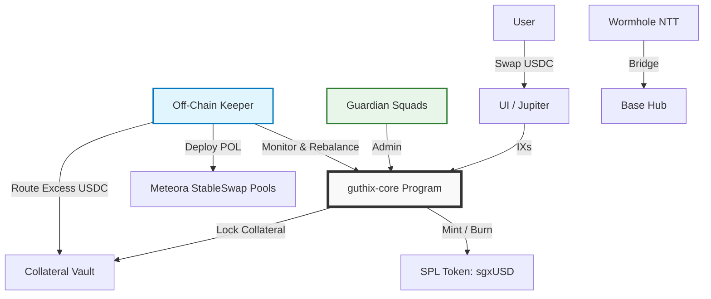

# GUTHIX Protocol Litepaper

> **The Yield Vault Standard**
> **Version:** 2.1.0
> **Date:** March 2026
> **Status:** 🚧 In Development
> **Network:** Solana (Operations) | Base (Governance Hub)

---

## 📋 Abstract

GUTHIX is a minimalist decentralized liquidity protocol built around a single token: **sgxUSD**. Users swap USDC in, hold, and appreciate. That is the entire user experience.

sgxUSD has yield because it is always paired against yield-bearing assets. This is not a feature — it is the foundation. Protocol-Owned Liquidity (POL) is deployed exclusively into StableSwap pools pairing sgxUSD against sUSDe, syrupUSDC, and USDY. Both sides of every yield pool appreciate natively, compounding together without harvesting, without conversion, and without yield leakage. A separate sgxUSD/USDC pool serves as the entry and exit ramp — infrastructure, not yield engine.

There are no governance tokens. No token emissions. No staking UI. No redemption queues. No synthetic units. One token, one action, passive yield.

**Key Principles:**
- **Yield-Bearing Foundation:** sgxUSD is paired against yield-bearing assets from day one. Without this, sgxUSD has no yield source and no reason to exist.
- **Native Compounding:** Both sides of every yield pool appreciate together. No harvesting. No conversion tax. No yield leakage.
- **Swap-to-Grow:** Excess USDC from secondary market buys routes directly to vault collateral, raising sgxUSD NAV instantly.
- **Silent Rebalance:** User exits are absorbed by POL — no redemption queues, no user friction.
- **Pure Real Yield:** 100% of revenue flows to sgxUSD holders via NAV appreciation. Zero emissions. Zero dilution.

---

## 🎯 Problem Statement

### Fragmented Liquidity
Stablecoin liquidity is siloed across chains, AMMs, and collateral types. Traders face high slippage; LPs face impermanent loss and emission dependency.

### Unsustainable Yield Models
Most protocols subsidize APY with inflationary token emissions, creating sell pressure and mercenary capital that exits when rewards end.

### Yield Leakage
Protocols that harvest yield-bearing collateral and convert to base assets destroy compounding. The conversion step is itself a loss — yield that could compound natively is instead taxed at every cycle.

### Complexity Overhead
Redemption queues, multi-token systems, staking UX, and governance voting increase smart contract risk and user friction. Users should not need to manage positions to earn yield.

### Regulatory Uncertainty
Yield-bearing tokens with emission mechanics face heightened scrutiny as potential unregistered securities.

---

## 💡 Solution Overview

GUTHIX addresses these challenges through four core principles:

| Principle | Implementation | Benefit |
|-----------|---------------|---------|
| **Minimalist Security** | Single custom Anchor program (`guthix-core`); governance via Squads Multisig; bridging via Wormhole NTT | Reduced audit surface; lower attack vector count |
| **Pure Real Yield** | 100% of protocol revenue flows to sgxUSD NAV; zero emissions | Sustainable APY; no dilution; regulatory clarity |
| **Native Compounding** | sgxUSD paired directly against yield-bearing stablecoins; both sides grow together without harvesting | No conversion tax; maximum yield retention |
| **Silent Rebalance** | Off-chain Keeper absorbs exits and rebalances POL automatically | No redemption queues; no bank-run vector; seamless exits |

---

## 🏗 Technical Architecture

### Minimalist Design Philosophy



### Component Breakdown

| Component | Implementation | Responsibility |
| :--- | :--- | :--- |
| **Core Logic** | `guthix-core` (Anchor) | Collateral locking, NAV calculation, sgxUSD minting/burning, config |
| **Governance** | Squads Protocol (Multisig) | Parameter updates, emergency pauses, Keeper authorization |
| **Token** | SPL Token | sgxUSD vault token |
| **Bridging** | Wormhole NTT | Canonical lock/mint across Solana ↔ Base |
| **Liquidity** | Meteora StableSwap | Protocol-Owned Liquidity across all pool pairs |
| **Maintenance** | Off-Chain Keeper (Rust/TS) | POL rebalancing, NAV updates, Swap-to-Grow routing, pool monitoring |

### Smart Contract Scope (v1.0)

```rust
// guthix-core program instructions
pub enum Instruction {
    Initialize,           // Setup vault, token mint, guardian
    Deposit,              // Lock collateral → Mint sgxUSD at current NAV
    Withdraw,             // Burn sgxUSD → Withdraw collateral at current NAV
    WithdrawCollateral,   // Keeper-only: Unlock collateral for POL deployment
    UpdateNAV,            // Keeper-only: Update sgxUSD exchange rate
    UpdateConfig,         // Guardian-only: Adjust params, pause, keeper address
    Pause,                // Guardian-only: Emergency halt
}
```

✅ **Only 7 instructions.** No staking logic. No governance voting. No emission schedules. No synthetic token minting.

---

## 💰 sgxUSD: The GUTHIX Vault Token

sgxUSD is the sole token of the GUTHIX protocol. It is a vault token: its value starts at $1.00 and floats upward as protocol revenue accrues. It is not pegged. It is not a stablecoin. It is a claim on the GUTHIX vault that appreciates passively over time.

| Property | Specification |
|----------|--------------|
| **Type** | SPL Token |
| **Value** | Floats upward from $1.00 as NAV accrues; not pegged |
| **Collateral** | Yield-bearing basket: sUSDe (Ethena), syrupUSDC (Maple), USDY (Ondo) |
| **Acquisition** | Swap USDC → sgxUSD via Jupiter or app.guthix.finance |
| **Exit** | Swap sgxUSD → USDC via secondary market (Silent Rebalance) |
| **Redemption** | ❌ No direct redemption; exits are via secondary market only |
| **Yield** | Passive NAV appreciation; no claiming, no staking, no locking |
| **Bridging** | ✅ Enabled: Burn on Solana → Mint canonical on Base via Wormhole NTT |
| **Risk** | sgxUSD holders absorb protocol-level risk; sgxUSD serves as the safety backstop |

### sgxUSD as Safety Backstop

Because there is no governance token to absorb protocol-level losses, sgxUSD holders bear the risk of the vault. In a stress scenario — such as a collateral asset depegging — sgxUSD NAV may compress. This is a deliberate design choice: holders are compensated with real yield for bearing real risk. The protocol makes no guarantee of NAV stability — only that 100% of revenue flows to sgxUSD holders and that the vault is managed conservatively.

---

## 🔄 Economic Model: The Real Yield Flywheel

### Design Philosophy

GUTHIX operates on a single economic principle: **all protocol revenue flows to sgxUSD holders via NAV appreciation, with zero dilution.** There are no token emissions, no emission schedules, and no inflationary rewards. Yield is real, or it does not exist.

### Pool Architecture

GUTHIX deploys Protocol-Owned Liquidity across four Meteora StableSwap pools. The yield-bearing pools are the core of the protocol — they are not a roadmap item, they are a launch requirement. The sgxUSD/USDC pool exists solely as an entry and exit ramp.

| Pool | Role | Swap Fee |
|------|------|---------|
| **sgxUSD / sUSDe** | Yield engine — Ethena funding rate yield | 0.10% |
| **sgxUSD / syrupUSDC** | Yield engine — Maple credit yield | 0.10% |
| **sgxUSD / USDY** | Yield engine — Ondo RWA yield | 0.10% |
| **sgxUSD / USDC** | Entry / exit ramp only | 0.05% |

**Capital allocation at launch:**

| Pool | Allocation |
|------|-----------|
| sgxUSD / sUSDe | 35% |
| sgxUSD / syrupUSDC | 30% |
| sgxUSD / USDY | 20% |
| sgxUSD / USDC | 15% |

The USDC pool receives the smallest allocation because it is infrastructure, not yield. The yield-bearing pools receive the majority of capital because they are the product.

**Why StableSwap for all pools:** sUSDe, syrupUSDC, and USDY all trade close to their USD value. sgxUSD starts at $1.00 and appreciates at roughly the blended yield rate of its paired assets — so the ratio between sgxUSD and its counterparts remains naturally stable over time. StableSwap math is efficient within this band, keeping slippage low without requiring dynamic range management.

**Why no harvesting:** Harvesting yield-bearing collateral and converting to USDC destroys compounding. By pairing sgxUSD directly against yield-bearing assets, both sides appreciate natively. The pool itself becomes a yield amplifier — no Keeper intervention required to capture yield.

### How sgxUSD NAV Grows

sgxUSD NAV appreciates from two compounding streams:

**1. Native Collateral Yield**
Each yield-bearing pool counterpart — sUSDe, syrupUSDC, USDY — appreciates in value independently. As these assets grow, they increase the collateral value backing sgxUSD directly. The blended rate across the basket drives core NAV appreciation continuously, without any Keeper action required.

**2. Trading Fees**
All four StableSwap pools earn trading fees from swap activity. These fees accrue to the POL positions and are routed by the Keeper into the vault, further increasing sgxUSD NAV on top of collateral yield.

```
sgxUSD NAV appreciation =
  Blended collateral yield (sUSDe + syrupUSDC + USDY, weighted by allocation)
  + Trading fees from all four pools
```

### Swap-to-Grow: Organic Vault Expansion

When users swap USDC → sgxUSD on the secondary market, USDC accumulates in the POL pool. The Keeper detects this imbalance and routes the excess USDC directly into the vault as additional collateral. No new sgxUSD is minted. The collateral backing each existing sgxUSD increases, raising NAV immediately. Every secondary market buy is a direct yield event for all sgxUSD holders.

```
User swaps USDC → sgxUSD on Jupiter
        ↓
sgxUSD / USDC pool accumulates excess USDC
        ↓
Keeper routes excess USDC → Vault collateral
        ↓
sgxUSD NAV increases
        ↓
All sgxUSD holders benefit instantly
```

### Silent Rebalance: Exits Without Queues

When users sell sgxUSD → USDC on the secondary market, POL absorbs the flow. The Keeper monitors pool balances and rebalances as needed. There are no redemption queues, no withdrawal delays, and no bank-run mechanics.

Because sgxUSD exits are expected and planned for, POL depth at any given TVL level is sized to absorb normal exit flow. Large coordinated exits widen the spread naturally, creating an arbitrage opportunity that incentivizes re-entry.

### Why No Token Emissions

| With Emissions | GUTHIX |
|---|---|
| APY = fees + token inflation | APY = native collateral yield + trading fees |
| Emissions create sell pressure | No sell pressure |
| Mercenary capital exits when rewards end | Yield seekers hold for compounding |
| Harvest tax destroys compounding | No harvesting; both pool sides compound natively |
| APY collapses at maturity | APY scales with collateral basket and TVL |
| Complex claim/stake UX | Swap in. Hold. Nothing else required. |

Emissions create a subsidy that must eventually be paid by someone. GUTHIX never makes that promise.

---

## 🛡 Security & Risk Management

### Defense-in-Depth Strategy

| Layer | Implementation | Purpose |
| :--- | :--- | :--- |
| **Minimal Code** | Single custom program (`guthix-core`); 7 instructions; single token | Smallest possible audit surface |
| **Standard Dependencies** | Squads (governance), Wormhole (bridging), SPL (token), Meteora (AMM) | Battle-tested, audited infrastructure only |
| **Off-Chain Keeper** | Logic upgradable without redeployment; PDA-signed withdrawals | Isolate complexity; enable rapid iteration |
| **Guardian Multisig** | 3-of-5 trusted signers; emergency pause; config updates | Human oversight for black-swan events |
| **Transparency** | Real-time NAV, collateral proofs, Keeper activity on-chain | Community verification; reduced information asymmetry |

### Risk Mitigations

| Risk | Mitigation |
| :--- | :--- |
| **sgxUSD NAV Compression** | sgxUSD holders absorb protocol risk by design; POL depth ensures exit liquidity; Silent Rebalance absorbs sells |
| **Collateral Depeg (sUSDe / syrupUSDC / USDY)** | Diversified basket limits single-asset exposure; Guardian pause if deviation exceeds threshold; Pyth/Switchboard dual-oracle monitoring |
| **Impermanent Loss (POL)** | Stable pairs only; sgxUSD appreciates at blended basket rate, keeping pool ratios naturally stable; IL minimized by design |
| **Keeper Compromise** | PDA signing; withdrawal limits per epoch; multi-sig override; real-time monitoring alerts |
| **Oracle Manipulation** | Pyth + Switchboard dual feeds; TWAP pricing; deviation circuit breakers |
| **Regulatory Scrutiny** | sgxUSD framed as vault token, not stablecoin; yield is NAV appreciation from real revenue; no profit guarantees; legal review pre-mainnet |

### Audit Strategy

- **Phase 1**: Community review + formal verification of `guthix-core`
- **Phase 2**: Professional audit (OtterSec / Neodyme) pre-mainnet
- **Ongoing**: Bug bounty via Immunefi; transparent incident response

---

## 🗓 Roadmap

| Phase | Timeline | Milestones | Success Metrics |
| :--- | :--- | :--- | :--- |
| **Phase 1: Core Foundation** | Q2 2026 | • `guthix-core` devnet deployment <br> • SPL Token integration <br> • Keeper bot MVP <br> • All four pools on devnet <br> • Community audit | • 100+ testnet users <br> • Zero critical bugs <br> • Full pool architecture validated on devnet |
| **Phase 2: Mainnet Launch** | Q3 2026 | • Professional audit complete <br> • Collateral partner POL seeding (Ethena / Maple / Ondo) <br> • All four pools live on mainnet <br> • Jupiter aggregator integration | • All yield-bearing pools live at launch <br> • <1% slippage on $10K trades <br> • Swap-to-Grow active on mainnet |
| **Phase 3: Multichain** | Q4 2026 | • Wormhole NTT (Solana ↔ Base) <br> • Lending protocol integrations (Kamino / MarginFi) <br> • Public analytics dashboard | • $2M+ cross-chain TVL <br> • Sub-5s bridge finality <br> • Top-10 Solana yield token by TVL |
| **Phase 4: Decentralization** | Q1 2027 | • Guardian Council activation <br> • Safety Fund >5% TVL <br> • Keeper bonding (optional) <br> • Additional collateral assets (community vote) | • 3+ independent Keeper operators <br> • $10M+ cumulative yield distributed |

---

## 🤝 Ecosystem Integrations

### Collateral Partners

The yield-bearing pools are a launch requirement, not a roadmap item. Seeding these pools is a direct co-marketing opportunity for each collateral partner — their asset gains distribution across all of Solana via Jupiter routing from day one.

| Partner | Pool | Benefit to Partner |
| :--- | :--- | :--- |
| **Ethena (sUSDe)** | sgxUSD / sUSDe | sUSDe distribution across Solana; trading fee revenue |
| **Maple (syrupUSDC)** | sgxUSD / syrupUSDC | syrupUSDC DeFi liquidity; new depositor surface |
| **Ondo (USDY)** | sgxUSD / USDY | USDY DeFi accessibility; institutional yield exposure on Solana |

### Infrastructure Partners

| Partner | Integration | Benefit |
| :--- | :--- | :--- |
| **Meteora** | StableSwap pools for all sgxUSD pairs | Low-slippage liquidity; native yield compounding |
| **Wormhole** | NTT for canonical cross-chain sgxUSD supply | Seamless Solana ↔ Base bridging |
| **Jupiter** | Aggregator routing for sgxUSD / USDC | Instant access for all Solana users; Swap-to-Grow activation |
| **Kamino / MarginFi** | sgxUSD as lending collateral | Capital efficiency for borrowers; sgxUSD demand |
| **Pyth / Switchboard** | Dual-oracle NAV monitoring | Manipulation-resistant collateral pricing |
| **Squads** | Guardian multisig governance | Secure parameter management; emergency controls |

### Grant Strategy

- **Solana Foundation**: Infrastructure grant for minimalist DeFi innovation
- **Wormhole**: Cross-chain liquidity incentive program
- **Meteora**: Ecosystem fund for new pool liquidity seeding
- **Ethena / Maple / Ondo**: Collateral partnership — POL co-seeding as launch requirement

---

## 📞 Getting Involved

### For Developers
```bash
git clone https://github.com/guthix-protocol/guthix-core.git
cd guthix-core
anchor test
```
- Contribute to `guthix-core` or the Keeper bot
- Build integrations using the TypeScript SDK
- Submit audit findings to security@guthix.finance

### For Collateral Partners
GUTHIX is seeking co-seeding partners for the yield-bearing pools at launch. Each partner seeds their respective pool, gains Jupiter routing distribution across Solana, and earns trading fees on their seeded capital. Contact: partnerships@guthix.finance

### For Users
1. Swap USDC → sgxUSD on Jupiter or via app.guthix.finance
2. Hold to earn passive yield via NAV appreciation
3. Bridge to Base via Wormhole NTT
4. Use as collateral on Kamino or MarginFi, trade, or hold

### For Contributors
- Follow updates: [@GuthixProtocol](https://twitter.com/GuthixProtocol)
- Propose improvements via GitHub Discussions

---

## ⚠️ Disclaimer

*This document is for informational purposes only and does not constitute financial advice, investment recommendations, or an offer to sell or solicitation of an offer to buy any securities, tokens, or other financial instruments. GUTHIX is a decentralized protocol operating on a best-efforts basis. Participants acknowledge that they are using the software at their own risk. Cryptocurrency investments are volatile, speculative, and high-risk. sgxUSD is a vault token whose value floats and is not guaranteed to appreciate. Collateral assets including sUSDe, syrupUSDC, and USDY carry their own independent risks. Past performance is not indicative of future results. Please consult independent legal, financial, and tax advisors before participating in any protocol. The GUTHIX Foundation does not guarantee the accuracy, completeness, or reliability of any information contained herein.*

---

## 📄 License

This litepaper and associated documentation are licensed under the **MIT License**. See [LICENSE](./LICENSE) for details.

---

*© 2026 Guthix Protocol. All rights reserved.*
*Built on Solana. Secured by minimalism.*
*One token. Pure yield. Liquidity that builds itself.*
