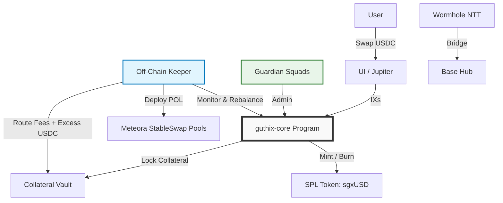

# GUTHIX Protocol Litepaper

> **The Yield-Bearing Liquidity Hub**
> **Version:** 3.0.0
> **Date:** March 2026
> **Status:** 🚧 In Development
> **Network:** Solana (Operations) | Base (Bridge)

---

## 📋 Abstract

GUTHIX is a minimalist decentralized liquidity protocol and the first yield-bearing liquidity hub for the Solana stablecoin ecosystem. It is built around a single token: **sgxUSD**.

sgxUSD generates yield from multiple structurally uncorrelated sources simultaneously — Ethena funding rates, Maple credit yield, Ondo RWA yield, and trading fees from bridge arbitrage across Wormhole-bridged stablecoin pairs. No single source dominates. If one yield source compresses, the others carry the basket. This diversification is structural, not cosmetic.

Users swap USDC in, hold, and appreciate. That is the entire user experience.

Protocol-Owned Liquidity (POL) is deployed across three pool tiers: yield-bearing StableSwap pools that compound natively alongside sgxUSD, bridge liquidity pools that capture constant arb flow from users unwinding Wormhole bridge positions, and a single USDC entry and exit ramp. All fees and yield flow to sgxUSD NAV appreciation. Zero emissions. Zero dilution. One token.

**Key Principles:**
- **Yield-Bearing Foundation:** sgxUSD is paired against yield-bearing assets from day one. Native collateral yield compounds directly into sgxUSD NAV without harvesting or conversion.
- **Bridge Liquidity Hub:** GUTHIX provides deep liquidity for Wormhole-bridged USDC variants from Ethereum, BNB Chain, and Polygon — capturing arb fees as a structurally distinct yield source.
- **Diversified Yield:** sgxUSD draws from funding rates, credit yield, RWA yield, and bridge arb fees simultaneously. Structural diversification across uncorrelated sources.
- **Pure Real Yield:** 100% of all revenue flows to sgxUSD holders via NAV appreciation. Zero emissions. Zero dilution.
- **Minimalist Architecture:** Single custom program, seven instructions, one token. No governance tokens, no staking UI, no redemption queues, no synthetic units.

---

## 🎯 Problem Statement

### Fragmented Stablecoin Liquidity on Solana
Stablecoin liquidity on Solana is siloed across chains, AMMs, and collateral types. Wormhole-bridged USDC variants from Ethereum, BNB Chain, and Polygon exist in meaningful quantities but face thin liquidity, high slippage, and no productive yield. They are stranded capital with nowhere to go.

### Single-Source Yield Concentration
Existing yield-bearing stablecoins — sUSDe, syrupUSDC, USDY — each expose holders to a single yield source. When Ethena funding rates compress, sUSDe yield compresses. When credit markets tighten, syrupUSDC yield compresses. Holders have no structural protection against source-specific yield compression.

### Unsustainable Yield Models
Most protocols subsidize APY with inflationary token emissions, creating sell pressure and mercenary capital that exits when rewards end.

### Yield Leakage
Protocols that harvest yield-bearing collateral and convert to base assets destroy compounding. The conversion step is itself a loss — yield that could compound natively is instead taxed at every cycle.

### Complexity Overhead
Redemption queues, multi-token systems, staking UX, and governance voting increase smart contract risk and user friction. Users should not need to manage positions to earn yield.

---

## 💡 Solution Overview

GUTHIX addresses these challenges through five core principles:

| Principle | Implementation | Benefit |
|-----------|---------------|---------|
| **Bridge Liquidity Hub** | StableSwap pools for whUSDC.e, whUSDC.bnb, whUSDC.poly, USDT0 | Captures bridge arb fees; provides Solana's deepest bridged stablecoin liquidity |
| **Native Compounding** | sgxUSD paired directly against yield-bearing assets; no harvesting | No conversion tax; maximum yield retention |
| **Diversified Yield** | Funding rates + credit yield + RWA yield + bridge arb fees | Structurally uncorrelated sources; yield floor even when individual sources compress |
| **Pure Real Yield** | 100% of all revenue flows to sgxUSD NAV; zero emissions | Sustainable APY; no dilution; regulatory clarity |
| **Minimalist Security** | Single Anchor program; Squads governance; Wormhole NTT bridging | Reduced audit surface; lower attack vector count |

---

## 🏗 Technical Architecture

### Minimalist Design Philosophy



### Component Breakdown

| Component | Implementation | Responsibility |
| :--- | :--- | :--- |
| **Core Logic** | `guthix-core` (Anchor) | Collateral locking, NAV calculation, sgxUSD minting/burning, config |
| **Governance** | Squads Protocol (Multisig) | Parameter updates, emergency pauses, Keeper authorization |
| **Token** | SPL Token | sgxUSD vault token |
| **Bridging** | Wormhole NTT | Canonical lock/mint across Solana ↔ Base |
| **Liquidity** | Meteora StableSwap | Protocol-Owned Liquidity across all pool tiers |
| **Maintenance** | Off-Chain Keeper (Rust/TS) | POL rebalancing, NAV updates, Swap-to-Grow routing, pool monitoring |

### Smart Contract Scope (v1.0)

```rust
// guthix-core program instructions
pub enum Instruction {
    Initialize,           // Setup vault, token mint, guardian
    Deposit,              // Lock collateral → Mint sgxUSD at current NAV
    Withdraw,             // Burn sgxUSD → Withdraw collateral at current NAV
    WithdrawCollateral,   // Keeper-only: Unlock collateral for POL deployment
    UpdateNAV,            // Keeper-only: Update sgxUSD exchange rate
    UpdateConfig,         // Guardian-only: Adjust params, pause, keeper address
    Pause,                // Guardian-only: Emergency halt
}
```

✅ **Only 7 instructions.** No staking logic. No governance voting. No emission schedules. No synthetic token minting.

---

## 💰 sgxUSD: The GUTHIX Vault Token

sgxUSD is the sole token of the GUTHIX protocol. It is a vault token: its value starts at $1.00 and floats upward as protocol revenue accrues. It is not pegged. It is not a stablecoin. It is a claim on the GUTHIX vault that appreciates passively over time, drawing yield from multiple structurally uncorrelated sources.

| Property | Specification |
|----------|--------------|
| **Type** | SPL Token |
| **Value** | Floats upward from $1.00 as NAV accrues; not pegged |
| **Yield Sources** | Ethena funding rates, Maple credit yield, Ondo RWA yield, bridge arb fees, trading fees |
| **Acquisition** | Swap USDC → sgxUSD via Jupiter or app.guthix.finance |
| **Exit** | Swap sgxUSD → USDC via secondary market (Silent Rebalance) |
| **Redemption** | ❌ No direct redemption; exits are via secondary market only |
| **Yield** | Passive NAV appreciation; no claiming, no staking, no locking |
| **Bridging** | ✅ Enabled: Burn on Solana → Mint canonical on Base via Wormhole NTT |
| **Risk** | sgxUSD holders absorb protocol-level risk; sgxUSD serves as the safety backstop |

### Why sgxUSD Over sUSDe or syrupUSDC Directly

sUSDe gives holders one yield source — Ethena funding rates. When funding rates compress, yield compresses. syrupUSDC gives holders one yield source — Maple credit yield. When credit markets tighten, yield tightens.

sgxUSD gives holders exposure to five structurally distinct yield sources in a single token, rebalanced by the protocol, with deep liquidity across Solana and Base via Jupiter routing. No individual yield source compression kills sgxUSD's return. And unlike holding sUSDe or syrupUSDC directly, sgxUSD provides collateral utility on Kamino and MarginFi, cross-chain accessibility via Wormhole NTT, and participation in bridge liquidity fees that neither underlying asset provides.

### sgxUSD as Safety Backstop

Because there is no governance token to absorb protocol-level losses, sgxUSD holders bear the risk of the vault. In a stress scenario — such as a collateral asset depegging — sgxUSD NAV may compress. This is a deliberate design choice: holders are compensated with real yield for bearing real risk. The protocol makes no guarantee of NAV stability — only that 100% of revenue flows to sgxUSD holders and that the vault is managed conservatively.

### NAV Appreciation as Capital Gains

Unlike yield-bearing stablecoins that distribute yield as income events, sgxUSD expresses all returns as NAV appreciation — a price increase in the token itself rather than a distribution. Depending on jurisdiction and holding period, this structure may result in capital gains treatment rather than ordinary income treatment at the point of sale. This is a meaningful potential advantage over holding sUSDe, syrupUSDC, or USDY directly, where yield typically accrues as ordinary income regardless of whether the holder sells.

*This is not tax advice. Tax treatment varies by jurisdiction and individual circumstance. Consult a qualified tax advisor before making investment decisions based on tax considerations.*

---

## 🔄 Economic Model: The Real Yield Flywheel

### Design Philosophy

GUTHIX operates on a single economic principle: **all protocol revenue flows to sgxUSD holders via NAV appreciation, with zero dilution.** There are no token emissions, no emission schedules, and no inflationary rewards. Yield is real, or it does not exist.

### Three-Tier Pool Architecture

GUTHIX deploys Protocol-Owned Liquidity across three distinct pool tiers, each serving a different structural role and contributing a different yield stream to sgxUSD NAV.

#### Tier 1 — Yield Engines

sgxUSD is paired directly against yield-bearing stablecoins. Both sides of each pool appreciate natively — no harvesting, no conversion, no yield leakage. The pool itself is the yield mechanism.

| Pool | Yield Source | Swap Fee |
|------|-------------|---------|
| sgxUSD / sUSDe | Ethena funding rate yield | 0.10% |
| sgxUSD / syrupUSDC | Maple credit yield | 0.10% |
| sgxUSD / USDY | Ondo RWA yield | 0.10% |

**Why no harvesting:** Converting yield-bearing collateral to USDC at every cycle destroys compounding. By pairing sgxUSD directly against these assets, both sides compound natively. The Keeper has no yield harvesting responsibility for Tier 1 pools — NAV appreciation happens automatically as the underlying assets grow.

**Why StableSwap:** sUSDe, syrupUSDC, and USDY all trade close to their USD value. sgxUSD appreciates at roughly the blended yield rate of its paired assets — so the ratio between sgxUSD and its counterparts remains naturally stable. StableSwap math is efficient within this band without requiring dynamic range management.

#### Tier 2 — Bridge Liquidity Hub

GUTHIX provides the deepest StableSwap liquidity on Solana for Wormhole-bridged USDC variants from Ethereum, BNB Chain, and Polygon, as well as USDT0. These pools serve users unwinding bridge positions and arbitrageurs maintaining cross-chain parity. Neither side of these pools appreciates natively — yield comes entirely from trading fees generated by constant bridge arb flow.

| Pool | Bridge Source | Swap Fee |
|------|-------------|---------|
| sgxUSD / whUSDC.e | Ethereum via Wormhole | 0.20% |
| sgxUSD / whUSDC.bnb | BNB Chain via Wormhole | 0.20% |
| sgxUSD / whUSDC.poly | Polygon via Wormhole | 0.20% |
| sgxUSD / USDT0 | Cross-chain USDT | 0.20% |

**Why this matters:** Wormhole-bridged USDC variants exist in meaningful quantities on Solana but face chronically thin liquidity, high slippage, and no productive yield. They are stranded capital. GUTHIX absorbs this capital as collateral, provides deep exit liquidity, and earns trading fees from every bridge unwind. No other yield-bearing token on Solana serves this role.

**Why higher fees:** Bridge pairs carry additional risk relative to native stablecoin pairs — bridged assets can depeg independently, have lower baseline liquidity, and require more active Keeper monitoring. The 0.20% fee reflects this risk and ensures the bridge arb yield contribution to sgxUSD NAV is meaningful.

#### Tier 3 — Entry / Exit Ramp

| Pool | Role | Swap Fee |
|------|------|---------|
| sgxUSD / USDC | Entry / exit ramp only | 0.05% |

The USDC pool is infrastructure, not yield. It receives the smallest capital allocation and the lowest swap fee, optimized for volume and Jupiter routing rather than revenue per swap. This is the pool through which most users enter and exit sgxUSD, and it must route cleanly through Jupiter aggregation to activate Swap-to-Grow.

### Capital Allocation

| Tier | Pools | Allocation |
|------|-------|-----------|
| Yield engines | sgxUSD / sUSDe, syrupUSDC, USDY | 50% |
| Bridge hub | sgxUSD / whUSDC.e, whUSDC.bnb, whUSDC.poly, USDT0 | 35% |
| Entry / exit ramp | sgxUSD / USDC | 15% |

### How sgxUSD NAV Grows

sgxUSD NAV appreciates from three compounding streams simultaneously:

**1. Native Collateral Yield (Tier 1)**
sUSDe, syrupUSDC, and USDY appreciate in value independently inside the Tier 1 pools. As these assets grow, they increase the collateral value backing sgxUSD directly. No Keeper action required — this yield is always on.

**2. Bridge Arb Fees (Tier 2)**
Every bridge unwind and cross-chain arbitrage trade through the Tier 2 pools generates trading fees. The Keeper routes these fees to the vault, increasing sgxUSD NAV continuously as bridge activity flows through the protocol.

**3. Trading Fees (All Tiers)**
All eight pools earn trading fees from swap activity. These fees compound on top of collateral yield and bridge arb fees, routed by the Keeper into the vault as additional NAV appreciation.

```
sgxUSD NAV appreciation =
  Blended Tier 1 collateral yield (sUSDe + syrupUSDC + USDY, weighted)
  + Tier 2 bridge arb trading fees (whUSDC.e + whUSDC.bnb + whUSDC.poly + USDT0)
  + Trading fees from all eight pools
```

**Yield source correlation:** Ethena funding rates, Maple credit markets, Ondo RWA yield, and Wormhole bridge arb flow are structurally uncorrelated. When one source compresses, the others are not necessarily affected. This is the core risk management property of the GUTHIX yield basket.

### Swap-to-Grow: Organic Vault Expansion

When users swap USDC → sgxUSD on the secondary market, USDC accumulates in the Tier 3 POL pool. The Keeper detects this imbalance and routes the excess USDC directly into the vault as additional collateral. No new sgxUSD is minted. The collateral backing each existing sgxUSD increases, raising NAV immediately. Every secondary market buy is a direct yield event for all sgxUSD holders.

```
User swaps USDC → sgxUSD on Jupiter
        ↓
sgxUSD / USDC pool accumulates excess USDC
        ↓
Keeper routes excess USDC → Vault collateral
        ↓
sgxUSD NAV increases
        ↓
All sgxUSD holders benefit instantly
```

### Silent Rebalance: Exits Without Queues

When users sell sgxUSD → USDC on the secondary market, POL absorbs the flow. The Keeper monitors pool balances and rebalances as needed across all tiers. There are no redemption queues, no withdrawal delays, and no bank-run mechanics.

Because sgxUSD exits are expected and planned for, POL depth across all tiers is sized to absorb normal exit flow. Large coordinated exits widen the spread naturally, creating an arbitrage opportunity that incentivizes re-entry.

### Why No Token Emissions

| With Emissions | GUTHIX |
|---|---|
| APY = fees + token inflation | APY = collateral yield + bridge arb fees + trading fees |
| Single or dual yield source | Five structurally uncorrelated yield sources |
| Emissions create sell pressure | No sell pressure |
| Mercenary capital exits when rewards end | Yield seekers hold for compounding |
| Harvest tax destroys compounding | No harvesting; Tier 1 pools compound natively |
| APY collapses at maturity | APY diversified across uncorrelated sources |
| Complex claim/stake UX | Swap in. Hold. Nothing else required. |

---

## 🌉 Cross-Chain Architecture

sgxUSD is a native Solana token that bridges canonically to Base via Wormhole NTT. On Base, sgxUSD participates in EVM DeFi — usable as collateral, tradeable on Base DEXs, and accessible to EVM users who want yield-bearing Solana-native exposure without bridging manually.

The bridge token design completes the liquidity hub narrative: GUTHIX absorbs bridged capital from Ethereum, BNB Chain, and Polygon via Tier 2 pools on Solana, and distributes sgxUSD back to EVM users via Base. Capital flows in from multiple chains and sgxUSD flows out as a unified yield-bearing asset.

| Direction | Mechanism | Result |
|-----------|-----------|--------|
| EVM → Solana | whUSDC variants absorbed by Tier 2 pools | Bridge arb fees → sgxUSD NAV |
| Solana → Base | Wormhole NTT lock/mint | sgxUSD accessible to EVM users |
| Base → Solana | Wormhole NTT burn/unlock | sgxUSD redeemable on Solana |

---

## 🛡 Security & Risk Management

### Defense-in-Depth Strategy

| Layer | Implementation | Purpose |
| :--- | :--- | :--- |
| **Minimal Code** | Single custom program (`guthix-core`); 7 instructions; single token | Smallest possible audit surface |
| **Standard Dependencies** | Squads, Wormhole, SPL Token, Meteora | Battle-tested, audited infrastructure only |
| **Off-Chain Keeper** | Logic upgradable without redeployment; PDA-signed withdrawals | Isolate complexity; enable rapid iteration |
| **Guardian Multisig** | 3-of-5 trusted signers; emergency pause; config updates | Human oversight for black-swan events |
| **Transparency** | Real-time NAV, collateral proofs, Keeper activity on-chain | Community verification; reduced information asymmetry |

### Risk Mitigations

| Risk | Mitigation |
| :--- | :--- |
| **sgxUSD NAV Compression** | sgxUSD holders absorb protocol risk by design; POL depth across all tiers ensures exit liquidity; Silent Rebalance absorbs sells |
| **Tier 1 Collateral Depeg** | Diversified basket across three uncorrelated yield sources limits single-asset exposure; Guardian pause if deviation exceeds threshold; Pyth/Switchboard dual-oracle monitoring |
| **Tier 2 Bridge Asset Depeg** | Four independent bridge pairs limit single-asset exposure; higher swap fees buffer risk; Keeper monitoring with Guardian pause authority |
| **Impermanent Loss (Tier 1 POL)** | sgxUSD appreciates at blended basket rate, keeping Tier 1 pool ratios naturally stable; IL minimized by design |
| **Impermanent Loss (Tier 2 POL)** | Higher swap fees offset IL risk; bridge pairs actively managed by Keeper; Guardian can pause individual pools |
| **Keeper Compromise** | PDA signing; withdrawal limits per epoch; multi-sig override; real-time monitoring alerts |
| **Oracle Manipulation** | Pyth + Switchboard dual feeds; TWAP pricing; deviation circuit breakers |
| **Regulatory Scrutiny** | sgxUSD framed as vault token, not stablecoin; yield expressed as NAV appreciation; no profit guarantees; legal review pre-mainnet |

### Audit Strategy

- **Phase 1**: Community review + formal verification of `guthix-core`
- **Phase 2**: Professional audit (OtterSec / Neodyme) pre-mainnet
- **Ongoing**: Bug bounty via Immunefi; transparent incident response

---

## 🗓 Roadmap

| Phase | Timeline | Milestones | Success Metrics |
| :--- | :--- | :--- | :--- |
| **Phase 1: Core Foundation** | Q2 2026 | • `guthix-core` devnet deployment <br> • SPL Token integration <br> • Keeper bot MVP <br> • All eight pools on devnet <br> • Community audit | • 100+ testnet users <br> • Zero critical bugs <br> • Full three-tier pool architecture validated |
| **Phase 2: Mainnet Launch** | Q3 2026 | • Professional audit complete <br> • Collateral partner POL seeding (Ethena / Maple / Ondo) <br> • All eight pools live on mainnet <br> • Jupiter aggregator integration | • All yield and bridge pools live at launch <br> • <1% slippage on $10K trades <br> • Swap-to-Grow active |
| **Phase 3: Multichain** | Q4 2026 | • Wormhole NTT (Solana ↔ Base) <br> • sgxUSD on Base DEXs <br> • Lending protocol integrations (Kamino / MarginFi) <br> • Public analytics dashboard | • sgxUSD live on Base <br> • $2M+ cross-chain TVL <br> • Top-10 Solana yield token by TVL |
| **Phase 4: Decentralization** | Q1 2027 | • Guardian Council activation <br> • Safety Fund >5% TVL <br> • Keeper bonding (optional) <br> • Additional collateral assets (community vote) | • 3+ independent Keeper operators <br> • $10M+ cumulative yield distributed |

---

## 🤝 Ecosystem Integrations

### Collateral Partners

The yield-bearing and bridge pools are launch requirements. Each collateral partner seeds their respective pool, gains Jupiter routing distribution across Solana, and earns trading fees on seeded capital.

| Partner | Pool | Value to Partner |
| :--- | :--- | :--- |
| **Ethena (sUSDe)** | sgxUSD / sUSDe | sUSDe distribution across Solana; trading fee revenue |
| **Maple (syrupUSDC)** | sgxUSD / syrupUSDC | syrupUSDC DeFi liquidity; new depositor surface |
| **Ondo (USDY)** | sgxUSD / USDY | USDY DeFi accessibility; institutional yield on Solana |

### Infrastructure Partners

| Partner | Integration | Benefit |
| :--- | :--- | :--- |
| **Meteora** | StableSwap pools for all sgxUSD pairs | Low-slippage liquidity; native yield compounding |
| **Wormhole** | NTT for canonical cross-chain sgxUSD; source of Tier 2 bridge assets | Seamless Solana ↔ Base bridging; bridge arb fee capture |
| **Jupiter** | Aggregator routing for all sgxUSD pairs | Instant access for all Solana users; Swap-to-Grow activation |
| **Kamino / MarginFi** | sgxUSD as lending collateral | Capital efficiency for borrowers; sgxUSD demand |
| **Pyth / Switchboard** | Dual-oracle NAV and collateral monitoring | Manipulation-resistant pricing across all tiers |
| **Squads** | Guardian multisig governance | Secure parameter management; emergency controls |

### Grant Strategy

- **Solana Foundation**: Infrastructure grant for minimalist DeFi innovation and bridge liquidity public good
- **Wormhole**: Cross-chain liquidity incentive program; Tier 2 pool seeding
- **Meteora**: Ecosystem fund for new pool liquidity seeding
- **Ethena / Maple / Ondo**: Collateral partnership — POL co-seeding as launch requirement

---

## 📞 Getting Involved

### For Developers
```bash
git clone https://github.com/guthix-protocol/guthix-core.git
cd guthix-core
anchor test
```
- Contribute to `guthix-core` or the Keeper bot
- Build integrations using the TypeScript SDK
- Submit audit findings to security@guthix.finance

### For Collateral Partners
GUTHIX is seeking co-seeding partners for the yield-bearing and bridge pools at launch. Each partner seeds their respective pool, gains Jupiter routing distribution across all of Solana, and earns trading fees on seeded capital. Contact: partnerships@guthix.finance

### For Users
1. Swap USDC → sgxUSD on Jupiter or via app.guthix.finance
2. Hold to earn passive yield via NAV appreciation across five uncorrelated yield sources
3. Bridge to Base via Wormhole NTT
4. Use as collateral on Kamino or MarginFi, trade, or hold

### For Contributors
- Follow updates: [@GuthixProtocol](https://twitter.com/GuthixProtocol)
- Propose improvements via GitHub Discussions

---

## ⚠️ Disclaimer

*This document is for informational purposes only and does not constitute financial advice, investment recommendations, or an offer to sell or solicitation of an offer to buy any securities, tokens, or other financial instruments. GUTHIX is a decentralized protocol operating on a best-efforts basis. Participants acknowledge that they are using the software at their own risk. Cryptocurrency investments are volatile, speculative, and high-risk. sgxUSD is a vault token whose value floats and is not guaranteed to appreciate. Collateral assets including sUSDe, syrupUSDC, USDY, and Wormhole-bridged stablecoin variants carry their own independent risks including depeg risk. Past performance is not indicative of future results. Any discussion of potential tax treatment is not tax advice and does not constitute a representation about the tax consequences of any investment. Please consult independent legal, financial, and tax advisors before participating in any protocol. The GUTHIX Foundation does not guarantee the accuracy, completeness, or reliability of any information contained herein.*

---

## 📄 License

This litepaper and associated documentation are licensed under the **MIT License**. See [LICENSE](./LICENSE) for details.

---

*© 2026 Guthix Protocol. All rights reserved.*
*Built on Solana. Secured by minimalism.*
*One token. Five yield sources. Liquidity that builds itself.*
